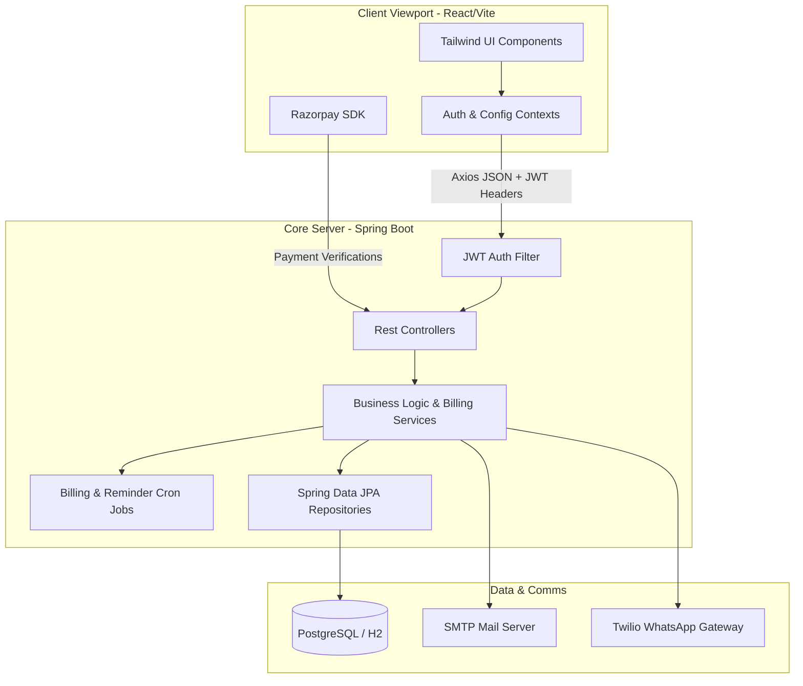

# PG CRM
### Premium Single-Tenant, White-Labeled Paying Guest & Hostel Management System

PG CRM is a modern, enterprise-grade Paying Guest (PG) and Hostel Management Platform designed for scale. Featuring multi-property management, a visual calendar-based meal planner, automated billing utilities, and a direct checkout pipeline, this solution serves owners, managers, and guests under a unified, high-performance web interface.

---

## 1. Architectural Pillars

The application follows a strictly decoupled client-server architecture designed around three key structural pillars:

### 1.1 Single-Tenant Data Isolation
To ensure the highest standard of data privacy, compliance, and customizability, PG CRM implements a **Single-Tenant Deployment Model**. 
* **Isolated Database Instances**: Each client deployment is provisioned with its own distinct database instance (using PostgreSQL in production). This prevents data leakage across different clients, simplifies custom schema expansions, and eases backups and compliance audits.
* **No Shared Resources**: Application execution and file storage are isolated per tenant, eliminating resource contention and "noisy neighbor" issues common in multi-tenant environments.

> [!TIP]
> **Production Reverse Proxy & Multi-Tenant Domain Routing**
> In a live production environment, a reverse proxy like **Nginx** handles incoming customer traffic for custom domains (e.g., `srisaipg.in`, `galaxyhostel.com`). Nginx acts as an edge router, matching host header domains to individual single-tenant backend ports and dynamically mounting SSL security layers via Let's Encrypt automated ACME clients.

### 1.2 Consolidated White-Labeling Engine
The system supports full whitelabel configurations out of the box through a single externalized configuration file (`tenant-config.yml`). 
* **Dynamic Assets**: Branding names, theme colors, dynamic logos, tax rates, support emails, and transaction configurations are loaded dynamically on boot.
* **External Configuration**: The backend dynamically looks up `./tenant-config.yml` on the host filesystem before falling back to default configurations, permitting administrators to customize properties without rebuilding application JARs.

```yaml
# Example tenant-config.yml
pg:
  system:
    branding:
      name: "Sri Sai Luxury PG"
      shortTitle: "Sri Sai"
    rules:
      foodIncludedInRent: false
      allowMealCancellations: true
      ebSplitMethod: "SUB_METER"
      hasWashingMachine: true
      paymentDueDayOfMonth: 5
      noticePeriodDays: 30
      breakfastEnabled: true
      lunchEnabled: true
      dinnerEnabled: true
      breakfastLockoutTime: "22:00:00"
      dinnerLockoutTime: "14:00:00"
    pricing:
      breakfast: 60.00
      lunch: 70.00
      dinner: 70.00
      washingMachine: 50.00
      omelette: 20.00
      boiledEgg: 15.00
```

### 1.3 Tenant Customization & Scope Separation
Role-Based Access Control (RBAC) separates administrative capabilities from guest interactions. Owners configure global setups, managers oversee operational logs, and guests view invoices and request maintenance, keeping operational boundaries clean.

---

## 2. Core Tech Stack



### 2.1 Backend Platform
* **Java 17 & Spring Boot 3.2.5**: Core runtime framework providing embedded Tomcat execution, dependency injection, and REST controllers.
* **Spring Data JPA & Hibernate**: Object-relational mapping, automatic DDL updating, and transactional queries.
* **Spring Security & JSON Web Tokens (JWT)**: Secures REST endpoints and verifies request authenticity stateless.
* **H2 / PostgreSQL**: In-memory H2 database for local development and PostgreSQL 15+ for production durability.

### 2.2 Frontend Client
* **React 18 & Vite**: Component-driven UI framework with fast building compilation.
* **Tailwind CSS**: Modern utility styling framework with a unified color token palette.
* **Lucide React**: Premium icon package.
* **Recharts**: Responsive SVG graphs for dashboard analytics.
* **Razorpay Checkout SDK**: Integrated client-side payment processing modal.

### 2.3 External Communications
* **Twilio WhatsApp API**: Dynamic WhatsApp messaging for payment reminders and receipts.
* **Spring Mail & Thymeleaf**: Dynamic HTML email template compilation and SMTP delivery.

---

## 3. Role-Based Access Control (RBAC)

The application utilizes a strict 3-tier user hierarchy:

| Role | Access Tier | Responsibilities & Capabilities |
| :--- | :--- | :--- |
| **PG Owner** (`PG_OWNER`) | Global Administrator | Creates and configures buildings, registers/edits property managers, assigns managers to multiple branches, views global audit logs, and monitors system-wide analytics. |
| **PG Manager** (`PG_MANAGER`) | Property Administrator | Manages checked-in guests, assigns rooms and beds, overrides prices, records sub-meter EB units, tracks daily add-on orders (omelettes, laundry, eggs), and generates monthly invoices. |
| **Guest** (`GUEST`) | Resident Portal | Views active check-in details, monitors monthly service usage, uses the calendar-based meal planner to schedule future meals, creates maintenance tickets, and pays bills online via Razorpay. |

---

## 4. Configuration & Environment Variables

Create an `.env` file in the root or set these parameters in your operating system environment:

### 4.1 Server Configuration
* `SERVER_PORT`: Port on which the Spring Boot application runs. Default is `8080`.
* `SPRING_PROFILES_ACTIVE`: Active runtime profile (`dev` for H2 database, `prod` for PostgreSQL).

### 4.2 Database Settings
* `SPRING_DATASOURCE_URL`: JDBC database connection string (e.g. `jdbc:postgresql://localhost:5432/pgcrmdb`).
* `SPRING_DATASOURCE_USERNAME`: Database login username.
* `SPRING_DATASOURCE_PASSWORD`: Database login password.

### 4.3 Third-Party API Keys
* `TWILIO_ACCOUNT_SID`: Account SID for WhatsApp reminders.
* `TWILIO_AUTH_TOKEN`: Secret Auth Token for Twilio API authentications.
* `TWILIO_WHATSAPP_NUMBER`: The sandbox or approved WhatsApp sender number (e.g., `whatsapp:+14155238886`).
* `RAZORPAY_KEY_ID`: Razorpay public API key (e.g. `rzp_test_SuLwO7L565iIkE`).
* `RAZORPAY_KEY_SECRET`: Razorpay secure key secret for validation.
* `RAZORPAY_ENABLED`: Flag to toggle Razorpay (`true` or `false`). When `false`, payments resolve through a mock transaction simulator.

---

## 5. Development Quick Start

### Prerequisites
* **Java Development Kit (JDK) 17** installed and on path.
* **Node.js (v18+)** and **npm** installed.
* **Maven 3.9+** (provided binary in `/apache-maven-3.9.6` can be used).

### 5.1 Local Execution (H2 Database - Development Mode)

#### Step 1: Start Backend Server
Navigate to the backend directory and launch the application using the default `dev` profile:
```bash
cd backend
../apache-maven-3.9.6/bin/mvn spring-boot:run
```
*The backend automatically boots on port `8080`, spins up an in-memory H2 database, and runs the `DataSeeder` runner to populate initial sample layout data.*

#### Step 2: Start Frontend Dev Server
Navigate to the frontend directory, install dependencies, and launch Vite:
```bash
cd frontend
npm install
npm run dev
```
*The frontend dev server launches on port `5173`. Access the web portal in your browser at `http://localhost:5173`.*

### 5.2 Seeded Demo Credentials
On startup, the system seeds default credentials for testing:
* **PG Owner**: `owner@pgcrm.com` / `Owner@123`
* **PG Manager**: `manager@pgcrm.com` / `Manager@123`
* **Guest**: `guest@pgcrm.com` / `Guest@123`

### 5.3 Interactive API Documentation
The backend exposes interactive OpenAPI 3.0 documentation using Swagger UI. When the server is running, navigate to:
* **Swagger UI URL**: [http://localhost:8080/swagger-ui.html](http://localhost:8080/swagger-ui.html)
This interactive sandbox lists all operational REST routes, DTO payload requirements, and security configurations, facilitating third-party developer integrations.

### 5.4 Running Testing Suites
The project includes end-to-end automated testing metrics for verifying codebase compliance.
* **Backend JUnit 5 Tests**:
  Navigate to the `/backend` folder and run:
  ```bash
  mvn test
  ```
* **Frontend Tests**:
  Navigate to the `/frontend` folder and run:
  ```bash
  npm run test
  ```

---

## 6. Docker Deployment

For clean staging or production deployments, use the provided Docker multi-stage configurations.

### 6.1 Multi-Stage Dockerfile
The application has a root Dockerfile that performs a two-stage build:
1. **Build Stage**: Compiles React frontend assets, drops them into the Spring Boot resource folder, and runs Maven package to compile the final fat executable JAR.
2. **Runtime Stage**: Creates a lightweight Alpine JRE runtime environment to run the backend jar.

### 6.2 Spin up using Docker Compose
Start the database service and the application container simultaneously:
```bash
docker-compose up --build
```
This launches:
* A **PostgreSQL 15** container listening internally on port `5432`.
* The **PG CRM Server** listening on port `8080`, mounting the config and seeding schemas.
