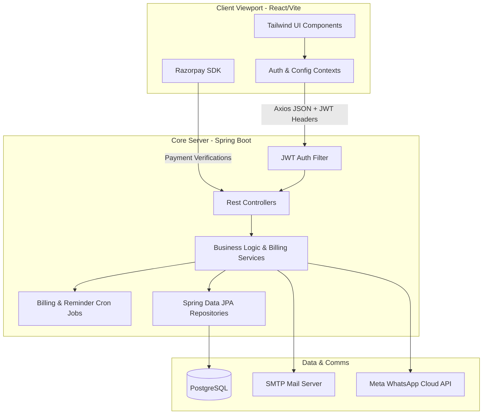

# PG CRM
### Premium Single-Tenant, White-Labeled Paying Guest & Hostel Management System

PG CRM is a modern, enterprise-grade Paying Guest (PG) and Hostel Management Platform designed for scale. Featuring multi-property management, a visual calendar-based meal planner, automated billing utilities, and a direct checkout pipeline, this solution serves owners, managers, and guests under a unified, high-performance web interface.

> [!NOTE]
> **System Workflows & Visual Models**
> For a detailed, visual breakdown of the application's core logic flows (including Auth, Check-In, Settlements, Bill Splits, Maintenance Tickets, and background Cron schedulers), refer to [WORKFLOWS.md](file:///e:/Antigravity%20Project/PG%20Project/docs/WORKFLOWS.md).

---

## 1. Architectural Pillars

The application follows a strictly decoupled client-server architecture designed around three key structural pillars:

### 1.1 Single-Tenant Data Isolation
To ensure the highest standard of data privacy, compliance, and customizability, PG CRM implements a **Single-Tenant Deployment Model**. 
* **Isolated Database Instances**: Each client deployment is provisioned with its own distinct database instance (using PostgreSQL in production). This prevents data leakage across different clients, simplifies custom schema expansions, and eases backups and compliance audits.
* **No Shared Resources**: Application execution and file storage are isolated per tenant, eliminating resource contention and "noisy neighbor" issues common in multi-tenant environments.

> [!TIP]
> **Production Reverse Proxy & Multi-Tenant Domain Routing**
> In a live production environment, a reverse proxy like **Nginx** handles incoming customer traffic for custom domains (e.g., `srisaipg.in`, `galaxyhostel.com`). Nginx acts as an edge router, matching host header domains to individual single-tenant backend ports and dynamically mounting SSL security layers via Let's Encrypt automated ACME clients.

### 1.2 Consolidated White-Labeling Engine
The system supports full whitelabel configurations out of the box through a single externalized configuration file (`tenant-config.yml`). 
* **Dynamic Branding**: Branding name and short title are loaded dynamically on boot from the YAML file.
* **External Configuration**: The backend dynamically looks up `./tenant-config.yml` on the host filesystem before falling back to Java class defaults, permitting administrators to customize branding values without rebuilding application JARs.

```yaml
# Example tenant-config.yml
pg:
  system:
    branding:
      name: "Sri Sai Luxury PG"
      short-title: "Sri Sai"
```

### 1.3 Tenant Customization & Scope Separation
Role-Based Access Control (RBAC) separates administrative capabilities from guest interactions. Owners configure global setups, managers oversee operational logs, and guests view invoices and request maintenance, keeping operational boundaries clean.

### 1.4 Dynamic Rules Engine & Guest Maintenance Portal
PG CRM incorporates a robust DB-backed configuration architecture:
* **Dynamic Rules Engine**: Building-specific prices, food options, EB splits, cutoff hours, and automatic billing scheduler statuses are stored in the database via the `BuildingConfig` model and managed directly through the Owner/Manager UI.
* **Guest Maintenance Portal**: Guests can report issues (Wi-Fi, plumbing, electrical) through their portal, selecting priority levels and viewing resolution state logs updated in real-time by the manager.

### 1.5 Multi-Channel Notifications & Verification Core
The platform incorporates secure self-service modules and automated messaging pipelines:
* **In-App & Multi-Channel Notifications**: Real-time push updates logged directly to the PostgreSQL database and served via an interactive header bell notification dropdown menu. The backend also supports automated email and WhatsApp reminders.
* **Secure Email verification OTPs**: Guest profile email updates require verification via a 6-digit code cached for 15 minutes in-memory using `EmailVerificationService`.
* **Temporary Password Resets**: A clean password-recovery flow allows requesting a high-entropy temporary password, enforcing a mandatory change-password check (`mustChangePassword` = true) upon subsequent logins.

---

## 2. Core Tech Stack



### 2.1 Backend Platform
* **Java 23 & Spring Boot 3.2.5**: Core runtime framework providing embedded Tomcat execution, dependency injection, and REST controllers.
* **Spring Data JPA & Hibernate**: Object-relational mapping, database transactions, and queries.
* **Flyway (Database Migrations)**: Standardizes database versioning, executing automated schema migrations (`V1` through `V5`) cleanly on server start.
* **MapStruct (DTO Mapping)**: Facilitates type-safe, high-performance object conversion between JPA entity objects and REST data transfer objects (DTOs).
* **Spring Security & JSON Web Tokens (JWT)**: Secures REST endpoints and verifies request authenticity stateless.
* **PostgreSQL**: PostgreSQL 18+ for both development and production durability.

### 2.2 Frontend Client
* **React 18 & Vite**: Component-driven UI framework with fast building compilation.
* **TanStack React Query (Server State)**: Performs async cache synchronization, server data mutation, and automated cache invalidation logic for guest and manager dashboards.
* **Vite PWA (Progressive Web App)**: Integrates client caching, background service worker installations (`sw.js`), updates notifications, offline rendering, and manifest configurations for mobile installations.
* **Tailwind CSS**: Modern utility styling framework with a unified color token palette.
* **Lucide React**: Premium icon package standardized to a thin, modern `strokeWidth={1.5}` layout across all UI pages.
* **Recharts**: Responsive SVG graphs for dashboard analytics.
* **Razorpay Checkout SDK**: Integrated client-side payment processing modal.

### 2.3 External Communications
* **Meta WhatsApp Cloud API**: Direct integration with the Meta Graph API for automated reminders, notifications, and webhook support.
* **Spring Mail & Thymeleaf**: Dynamic HTML email template compilation and SMTP delivery.

---

## 3. Role-Based Access Control (RBAC)

The application utilizes a strict 3-tier user hierarchy:

| Role | Access Tier | Responsibilities & Capabilities |
| :--- | :--- | :--- |
| **PG Owner** (`PG_OWNER`) | Global Administrator | Creates and configures buildings, registers/edits property managers, assigns managers to multiple branches, views global audit logs, and monitors system-wide analytics. |
| **PG Manager** (`PG_MANAGER`) | Property Administrator | Manages checked-in guests, assigns rooms and beds, overrides prices, records sub-meter EB units, tracks daily add-on orders (omelettes, laundry, eggs), and generates monthly invoices. |
| **Guest** (`GUEST`) | Resident Portal | Views active check-in details, monitors monthly service usage, uses the calendar-based meal planner to schedule future meals, creates maintenance tickets, and pays bills online via Razorpay. |

---

## 4. Configuration & Environment Variables

Create an `.env` file in the root or set these parameters in your operating system environment:

### 4.1 Server Configuration
* `SERVER_PORT`: Port on which the Spring Boot application runs. Default is `8080`.
* `SPRING_PROFILES_ACTIVE`: Active runtime profile (`dev` to wipe/rebuild development schema, `prod` for production schema validation mode, or `test` for a completely empty database and no seeders).

### 4.2 Database Settings
* `SPRING_DATASOURCE_URL`: JDBC database connection string (e.g. `jdbc:postgresql://localhost:5432/pgcrmdb`).
* `SPRING_DATASOURCE_USERNAME`: Database login username.
* `SPRING_DATASOURCE_PASSWORD`: Database login password.

### 4.3 Third-Party API Keys
### 4.3 Third-Party API Keys
* `META_WHATSAPP_PHONE_NUMBER_ID`: The Phone Number ID provided in the Meta App Dashboard.
* `META_WHATSAPP_ACCESS_TOKEN`: The system user access token for Meta Graph API calls.
* `META_WEBHOOK_VERIFY_TOKEN`: The custom token used to verify WhatsApp incoming webhooks.
* `RAZORPAY_KEY_ID`: Razorpay public API key (e.g. `rzp_test_SuLwO7L565iIkE`).
* `RAZORPAY_KEY_SECRET`: Razorpay secure key secret for validation.
* `RAZORPAY_ENABLED`: Flag to toggle Razorpay (`true` or `false`). When `false`, payments resolve through a mock transaction simulator.

---

## 5. Development Quick Start

### Prerequisites
* **Java Development Kit (JDK) 23** installed and on path.
* **Node.js (v24+)** and **npm** installed.
* **Maven 3.9.16+** (provided binary in `/apache-maven-3.9.16` can be used).

### 5.1 Local Execution (PostgreSQL Database - Decoupled Environment Profiles)

The application implements a profile-based database and data initialization strategy. To run the application, set `SPRING_PROFILES_ACTIVE` to one of the following:

* **Development Profile (`dev`)**: 
  - **Destructive Rebuild**: Drops the existing database schema and recreates all tables (`spring.jpa.hibernate.ddl-auto=create`).
  - **Flyway Disabled**: Skips Flyway migrations (`spring.flyway.enabled=false`) to avoid schema constraint conflicts.
  - **DatabaseSeeder Active**: Provisions the initial Owner account (`owner@pgcrm.com` / `Admin@123` or custom `.env` overrides).
* **Production Profile (`prod`)**:
  - **Schema Validation**: Validates the database schema matches entity mappings (`spring.jpa.hibernate.ddl-auto=validate`) without executing auto-alterations.
  - **Flyway Enabled**: Automatically applies incremental SQL schema migrations.
  - **DatabaseSeeder Disabled**: Mutes the `DatabaseSeeder` component (`@Profile("!prod")`) to protect live data tables.
* **Pure Test Profile (`test`)**:
  - **Destructive Wipe**: Wipes all tables cleanly (`spring.jpa.hibernate.ddl-auto=create`) to ensure a blank baseline.
  - **Flyway Disabled**: Skips migration scripts (`spring.flyway.enabled=false`) to speed up setup.
  - **Demo Data Muted**: Mutes all demo/guest seeding (`DataSeeder`), starting with a 100% empty database.
  - **DatabaseSeeder Active**: Retains the master `DatabaseSeeder` to dynamically provision the admin Owner login from environment variables, ensuring secure auth is immediately available.

#### Dynamic Super Admin Onboarding
The initial PG Owner login credentials are not hardcoded. The master `DatabaseSeeder` injects values dynamically from the host environment:
- `PG_DEFAULT_OWNER_EMAIL` (Default: `owner@pgcrm.com`)
- `PG_DEFAULT_OWNER_NAME` (Default: `System Owner`)
- `PG_DEFAULT_OWNER_PASSWORD` (Default: `Owner@123` or `Admin@123`)

#### Step 1: Start Backend Server
Navigate to the backend directory and launch the application (using the `dev` profile for initial startup or schema resets):
```bash
cd backend
# On Windows PowerShell:
$env:SPRING_PROFILES_ACTIVE="dev"; ../apache-maven-3.9.16/bin/mvn spring-boot:run
```
*The backend boots on port `8080`, wipes and rebuilds the local database structures, and seeds the master admin account.*

#### Step 2: Start Frontend Dev Server
Navigate to the frontend directory, install dependencies, and launch Vite:
```bash
cd frontend
npm install
npm run dev
```
*The frontend dev server launches on port `5173`. Access the web portal in your browser at `http://localhost:5173`.*

### 5.2 Seeded Demo Credentials
On startup, default credentials are seeded for local testing depending on the active profile:
* **PG Owner (dev profile)**: `owner@pgcrm.com` / `Admin@123` (seeded by `DatabaseSeeder`)
* **PG Owner (prod profile)**: `owner@pgcrm.com` / `Owner@123` (seeded by `DataSeeder`)
* **PG Manager (dev/prod profiles)**: `manager@pgcrm.com` / `Manager@123` (seeded by `DataSeeder`)
* **Guest (dev/prod profiles)**: `guest@pgcrm.com` / `Guest@123` (seeded by `DataSeeder`)
* **Test Profile (`test`)**: Dynamic Owner account generated; all other credentials and layout metadata are blank.

> [!IMPORTANT]
> **Direct Authentication Enforcement & Build-Time Security**
> - **Authentication**: The "QUICK LOGIN (DEMO)" panel and buttons have been removed from the login screen to strictly enforce real API-driven authentication. You must manually type the credentials above into the login inputs to sign in. In case the backend or database is unreachable, a clear server offline warning banner is displayed.
> - **Production Build Security**: The frontend production build pipeline utilizes Vite's native `esbuild` minifier, configured to completely strip all `console.log`, `console.warn`, `console.error`, and `debugger` statements from the compiled client bundles. This prevents data leakage (JWTs, PII) in browser developer tools.

### 5.3 Interactive API Documentation
The backend exposes interactive OpenAPI 3.0 documentation using Swagger UI. When the server is running, navigate to:
* **Swagger UI URL**: [http://localhost:8080/swagger-ui.html](http://localhost:8080/swagger-ui.html)
This interactive sandbox lists all operational REST routes, DTO payload requirements, and security configurations, facilitating third-party developer integrations.

### 5.4 Running Testing Suites
The project includes end-to-end automated testing metrics for verifying codebase compliance.
* **Backend JUnit 5 Tests**:
  Navigate to the `/backend` folder and run:
  ```bash
  mvn test
  ```
* **Frontend Tests**:
  Navigate to the `/frontend` folder and run:
  ```bash
  npm run test
  ```

---

## 6. Docker Deployment

For clean staging or production deployments, use the provided Docker multi-stage configurations.

### 6.1 Multi-Stage Dockerfile
The application has a root Dockerfile that performs a two-stage build:
1. **Build Stage**: Compiles React frontend assets, drops them into the Spring Boot resource folder, and runs Maven package to compile the final fat executable JAR.
2. **Runtime Stage**: Creates a lightweight Alpine JRE runtime environment to run the backend jar.

### 6.2 Spin up using Docker Compose
Start the database service and the application container simultaneously:
```bash
docker-compose up --build
```
This launches:
* A **PostgreSQL 18** container listening internally on port `5432` with an active healthcheck utilizing `pg_isready` to verify database health.
* The **PG CRM Server** listening on port `8080`, mounting the config and seeding schemas.

> [!TIP]
> **Fail-Fast Startup Sequencing**
> The backend application container (`app`) is configured to depend strictly on the database container (`postgres`) being healthy (`condition: service_healthy`). This prevents the application server from starting up and trying to initialize its database connection pool until the database daemon is fully initialized and accepting connections.

---

## 7. Folder Structure

The project root is structured to isolate source logic, local tooling, configuration, and documentation:

```
e:/Antigravity Project/PG Project/
├── backend/                       # Java/Spring Boot backend source
├── frontend/                      # React/Vite frontend source
├── apache-maven-3.9.16/           # Bundled Maven distribution
├── deploy/                        # Production deployment configuration templates
│   ├── docker-compose.prod.yml    # Production Docker Compose stack definition
│   ├── nginx-site.conf            # Nginx reverse proxy configuration template
│   └── .env.example               # Production environment variables template
├── docs/                          # Project documentation and test walkthroughs
│   ├── history/                   # Legacy planning and task files
│   ├── media/                     # Testing & tutorial media recordings
│   ├── CALCULATIONS_ENGINE.md     # Business calculation specs
│   ├── FILE_ARCHITECTURE.md       # Directory and file mapping
│   ├── WORKFLOWS.md               # User & system flows (mermaid diagrams)
│   ├── ONBOARDING_PROD.md         # Production onboarding & setup guide
│   ├── ONBOARDING_TEST.md         # Local testing & verification guide
│   └── client_onboarding_sop.md   # Client onboarding Standard Operating Procedure
├── scripts/                       # Maintenance and helper scripts
│   └── backup.sh                  # Postgres backup utility script
├── .env                           # Local development environment variables
├── .env.example                   # Template environment variables
├── .gitignore                     # Git ignore file
├── client_onboarding_sop.md       # Client onboarding Standard Operating Procedure (root duplicate)
├── Dockerfile                     # Multi-stage production build configuration
├── docker-compose.yml             # Local docker compose environment
├── README.md                      # Primary repository entry point documentation
├── start_project.bat              # Dev launcher script
└── tenant-config.yml              # White-label branding setup properties
```
