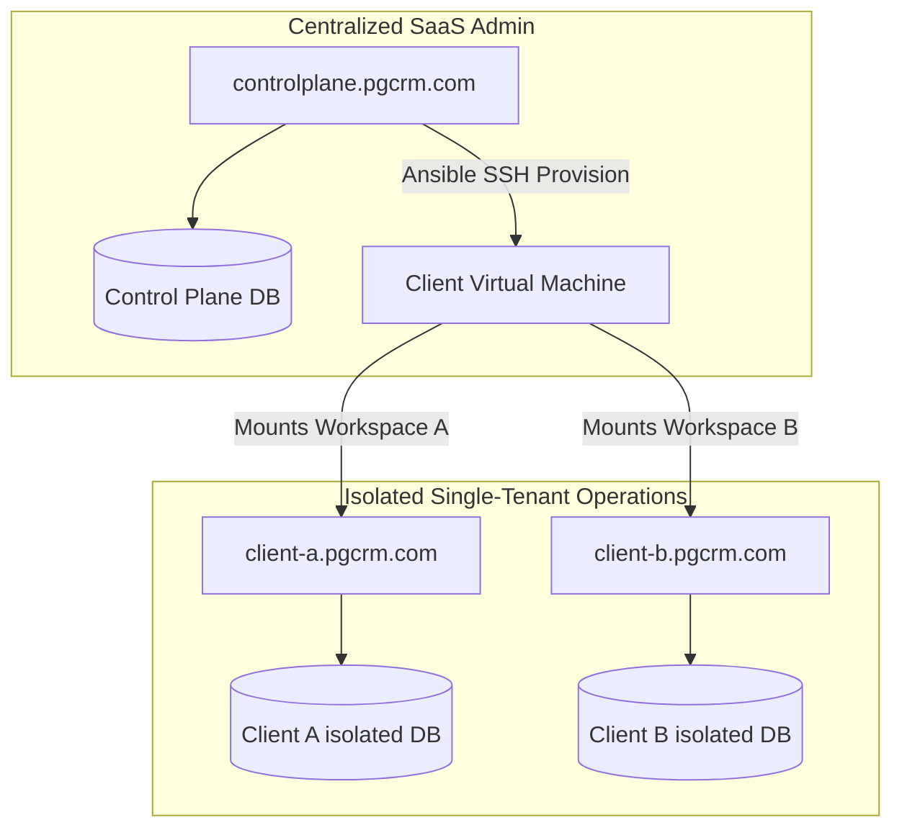

# PG CRM Monorepo
### Dual-Application Ecosystem: Core Hostel Operations & Master B2B SaaS Control Plane

Welcome to the PG CRM repository. This repository is organized as a monorepo containing two distinct applications:

1. **`[PG-CORE]` (Core PG CRM)**: Located under `/core-pg-crm/`. This is the single-tenant hostel management software that manages resident check-ins, room inventories, daily meal trackers, utility splits, in-app notifications, and guest invoicing/rent collections.
2. **`[CONTROL-PLANE]` (Master Control Plane)**: Located under `/master-control-plane/`. This is the centralized multi-tenant admin portal that registers B2B clients (PG Owners), processes AMC (Annual Maintenance Contract) setup payments, tracks subscription expiry, schedules renewal reminders, and automates single-tenant client instance provisioning.

---

## 1. System Boundaries & Tenant Isolation

This repository employs a **Hybrid Single-Tenant / Shared Control Plane** topology:



- **Tenant Operations (`[PG-CORE]`)**: Scoped strictly to daily property management. Run as independent single-tenant containers with fully isolated databases to prevent cross-tenant data leakage. Guest rent checkout queries run directly within each tenant's local database.
- **SaaS Billing & Reminders (`[CONTROL-PLANE]`)**: Scoped to central B2B SaaS administration. Manages tenant subdomains, registers payments via Razorpay, tracks AMC contract expirations, and coordinates automated reminders.

---

## 2. Monorepo Directory Layout

The repository is structured to separate application scopes, deployment configs, and shared developer documentation:

```
e:/Antigravity Project/PG Project/
├── core-pg-crm/                   # [PG-CORE] Core PG CRM source code
│   ├── backend/                   # Spring Boot 3 + Java 23 backend source
│   ├── frontend/                  # React 18 + Vite frontend source
│   ├── deploy/                    # Client Docker Compose & Nginx configs
│   │   ├── docker-compose.prod.yml
│   │   └── nginx-site.conf
│   ├── Dockerfile                 # Client multi-stage production builder
│   └── tenant-config.yml          # Client whitelabel config template
├── master-control-plane/          # [CONTROL-PLANE] Centralized SaaS Portal
│   ├── backend/                   # Spring Boot master admin app
│   └── frontend/                  # React dashboard for platform admins
├── docs/                          # Shared systems architecture manuals
│   ├── CALCULATIONS_ENGINE.md     # Business calculations & proration logic
│   ├── FILE_ARCHITECTURE.md       # Monorepo directory and file registry
│   ├── WORKFLOWS.md               # User & system flows (mermaid diagrams)
│   └── ONBOARDING.md              # Unified client onboarding & setup SOP
├── apache-maven-3.9.16/           # Bundled Maven distribution
├── .gitignore                     # Git ignore rules
└── README.md                      # Primary repository landing page
```

---

## 3. Production Deployment & Onboarding (VM Directory Separation)

In production environments, multiple white-labeled single-tenant instances of `[PG-CORE]` are hosted on the same virtual machine (VM) host by isolating workspace directories. Each client gets their own folder under `/opt/pgcrm/` containing their isolated Docker container configuration, environment secrets, and custom configs.

```
/opt/pgcrm/
├── client-a/                    # Isolated directory for Client A
│   ├── deploy/
│   │   ├── .env                 # Client A secrets & database credentials
│   │   └── docker-compose.yml   # Client A container orchestrations
│   └── tenant-config.yml        # Client A whitelabel branding overrides
└── client-b/                    # Isolated directory for Client B
    ├── deploy/
    │   ├── .env                 # Client B secrets & database credentials
    │   └── docker-compose.yml   # Client B container orchestrations
    └── tenant-config.yml        # Client B whitelabel branding overrides
```
Each container runs on independent local ports (e.g. `8080` for Client A, `8081` for Client B), which are mapped to their subdomains (e.g., `client-a.pgcrm.com`, `client-b.pgcrm.com`) via a central Nginx reverse proxy.

For detailed instructions on setting up local testing, UAT subdomains, Nginx proxy, Let's Encrypt SSL, and client handover procedures, please refer to the unified onboarding guide: **[ONBOARDING.md](file:///e:/Antigravity%20Project/PG%20Project/docs/ONBOARDING.md)**.

---

## 4. Development Quick Start: Core PG CRM (`[PG-CORE]`)

### Prerequisites
* **Java Development Kit (JDK) 23** installed and on path.
* **Node.js (v24+)** and **npm** installed.
* **Maven 3.9.16+** (bundled binary in `/apache-maven-3.9.16` can be used).
* **PostgreSQL 18** database running locally.

### Step 1: Start Backend Server
Navigate to the core backend folder, configure `.env`, and launch:
```bash
cd core-pg-crm/backend
# On Windows PowerShell:
$env:SPRING_PROFILES_ACTIVE="dev"; ../../apache-maven-3.9.16/bin/mvn spring-boot:run
```

### Step 2: Start Frontend Dev Server
Navigate to the core frontend folder, install dependencies, and launch Vite:
```bash
cd core-pg-crm/frontend
npm install
npm run dev
```
*Frontend dev server launches on port `5173`. Access the web portal in your browser at `http://localhost:5173`.*

---

## 5. Development Quick Start: Master Control Plane (`[CONTROL-PLANE]`)

Refer to the internal readme directories inside `/master-control-plane/` for database schema setups, Razorpay test sandbox config, and Spring scheduler verification protocols.
