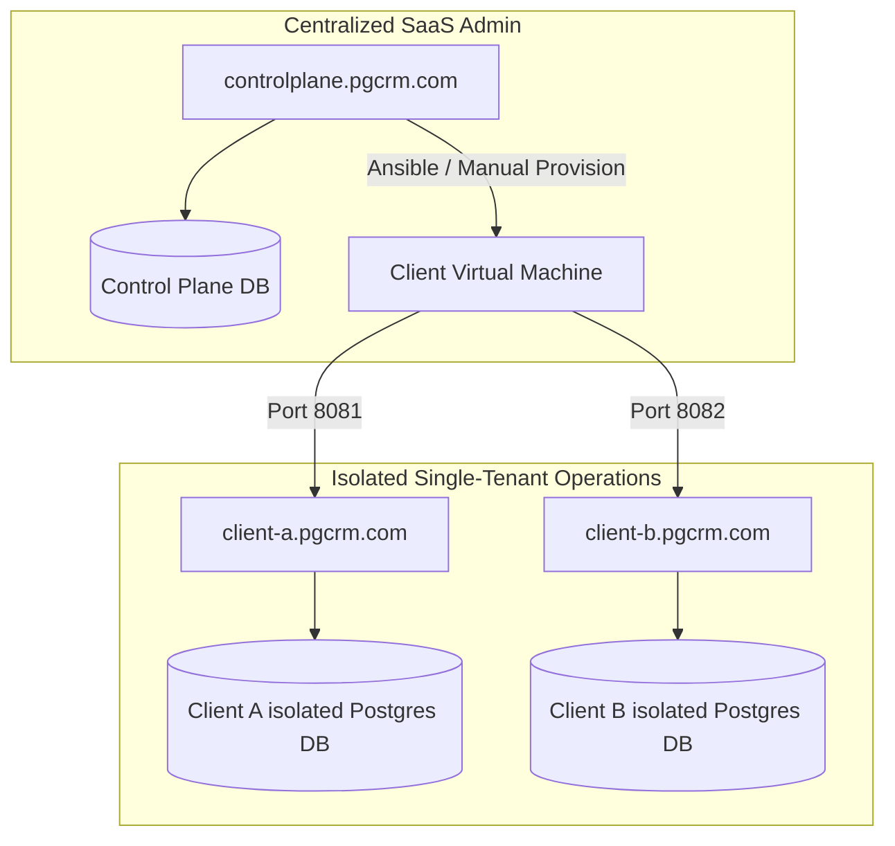

# PG CRM Ecosystem
### Enterprise Hostel Management & Automated B2B SaaS Control Plane

This repository operates as a **Monorepo**, housing the complete software suite required to run a multi-tenant, premium B2B SaaS business for Paying Guest (PG) and hostel operators.

The architecture is strictly decoupled into two isolated applications to protect core hostel operations from SaaS billing logic.

---

## 1. The Dual-Application Architecture

### 🏢 `[PG-CORE]` (Tenant Operations)
**Location:** `/core-pg-crm/`
The standalone, single-tenant hostel management software. 
* **Scope:** Daily property operations. Manages guest check-ins, automated arrears billing, electricity (EB) sub-meter utility splits, visual meal calendars, and maintenance ticketing.
* **Security:** Deployed as highly isolated, dedicated PostgreSQL databases and Spring Boot containers per client. Cross-tenant data leakage is physically impossible.

### ⚙️ `[CONTROL-PLANE]` (Master SaaS Billing)
**Location:** `/master-control-plane/`
The centralized B2B subscription command center and automated public front door.
* **Scope:** B2B client acquisition, subscription, and lifecycle management. Captures public Razorpay checkout payments, registers new clients into the deployment queue, tracks Annual Maintenance Contract (AMC) expirations, and triggers provisioning scripts.
* **Security:** Cryptographically verifies incoming payment webhooks via HMAC-SHA256 before granting `PENDING_DEPLOYMENT` status to a new instance.

---

## 2. Infrastructure & Tenant Isolation Model

The platform utilizes a **Hybrid Single-Tenant / Shared Control Plane** topology. The Control Plane manages the master ledger, while individual clients run on dedicated subdomains mapped to isolated VPS ports.



In production, multiple single-tenant instances of `[PG-CORE]` are hosted on the same VM host by isolating workspace directories. Each client gets their own folder under `/opt/pgcrm/` containing their isolated Docker container configuration, environment secrets, and whitelabel configs:

```
/opt/pgcrm/
├── client-a/                    # Isolated directory for Client A
│   └── deploy/
│       ├── .env                 # Client A secrets & database credentials
│       └── docker-compose.yml   # Client A container orchestrations
└── client-b/                    # Isolated directory for Client B
    └── deploy/
        ├── .env                 # Client B secrets & database credentials
        └── docker-compose.yml   # Client B container orchestrations
```

---

## 3. Hybrid Asset Business Model

The system operates on the **Hybrid Asset Model**:
1. **One-Time Setup Fee**: Client registers, pays ₹15,000 via Razorpay Checkout, and gets their custom subdomain set up with an isolated database.
2. **Annual Maintenance Contract (AMC)**: Includes 1 year of AMC. The master control plane runs a daily cron scheduler to evaluate expiration dates (sending reminder emails 30, 7, and 1 days before expiration).
3. **Suspension**: If the AMC expires without payment, the master portal suspends the tenant instance.

---

## 4. Monorepo Directory Layout

The repository is structured to separate application scopes, deployment configs, and shared developer documentation:

```
e:/Antigravity Project/PG Project/
├── core-pg-crm/                   # [PG-CORE] Core PG CRM source code
│   ├── backend/                   # Spring Boot 3 + Java 23 backend source
│   ├── frontend/                  # React 18 + Vite + Tailwind CSS frontend
│   ├── deploy/                    # Client Docker Compose & Nginx configs
│   ├── Dockerfile                 # Client production build Dockerfile
│   └── tenant-config.yml          # Client whitelabel config template
├── master-control-plane/          # [CONTROL-PLANE] Centralized SaaS Portal
│   ├── backend/                   # Spring Boot 3 + Java 23 master admin app
│   └── frontend/                  # React 18 + Vite + Tailwind v4 admin dashboard
├── docs/                          # Shared systems architecture manuals
│   ├── CALCULATIONS_ENGINE.md     # Business calculations & proration logic
│   ├── FILE_ARCHITECTURE.md       # Monorepo directory and file registry
│   ├── WORKFLOWS.md               # User & system flows (mermaid diagrams)
│   └── ONBOARDING.md              # Unified client onboarding & setup SOP
├── apache-maven-3.9.16/           # Bundled Maven distribution
└── README.md                      # Primary repository landing page
```

---

## 5. Development Quick Start & Startup Commands

### Prerequisites
* **JDK 23** installed and configured on your system PATH.
* **Node.js (v24+)** and **npm** installed.
* **PostgreSQL 18** database running locally.

### Running the core application: `[PG-CORE]`

#### 1. Start Core Backend:
Navigate to the core backend folder, configure your database parameters in `.env`, and launch via the bundled Maven wrapper:
```bash
cd core-pg-crm/backend
# On Windows PowerShell:
$env:SPRING_PROFILES_ACTIVE="dev"; ../../apache-maven-3.9.16/bin/mvn spring-boot:run
```

#### 2. Start Core Frontend:
Navigate to the core frontend folder, install dependencies, and start Vite:
```bash
cd core-pg-crm/frontend
npm install
npm run dev
```
*Accessible at `http://localhost:5173`.*

---

### Running the master billing portal: `[CONTROL-PLANE]`

#### 1. Start Control Plane Backend:
Navigate to the control plane backend folder, configure database connections, and start Spring Boot:
```bash
cd master-control-plane/backend
# On Windows PowerShell:
$env:SPRING_PROFILES_ACTIVE="dev"; ../../apache-maven-3.9.16/bin/mvn spring-boot:run
```

#### 2. Start Control Plane Frontend:
Navigate to the control plane frontend folder, install dependencies, and start Vite:
```bash
cd master-control-plane/frontend
npm install
npm run dev
```
*Accessible at `http://localhost:5173` (or the next available local port, e.g., `http://localhost:5174`).*
