# System Workflows & Visual Models

This document outlines the core business workflows, architectural data transitions, and entity lifecycle states of the Paying Guest CRM platform using visual sequence models.

---

## 1. Authentication & Token Refresh Flow
The frontend implements silent token refresh using an Axios interceptor to renew expired access tokens before failing subsequent requests.

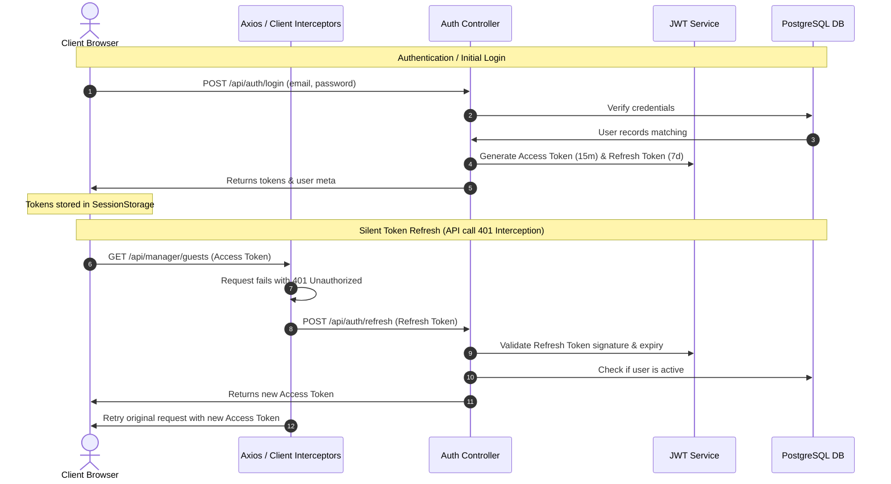

---

## 2. Guest Check-In & Provisioning Flow
Provisioning a new check-in allocates inventory, sets up a secure temp account, notifies the guest, and updates the building audit trail.

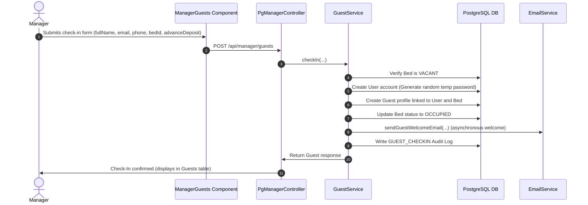

---

## 3. Checkout Notice & Financial Settlement Flow
Tracks the transition from notice registration (notice period) to final account settlement, pro-rated rent calculation, and bed release.

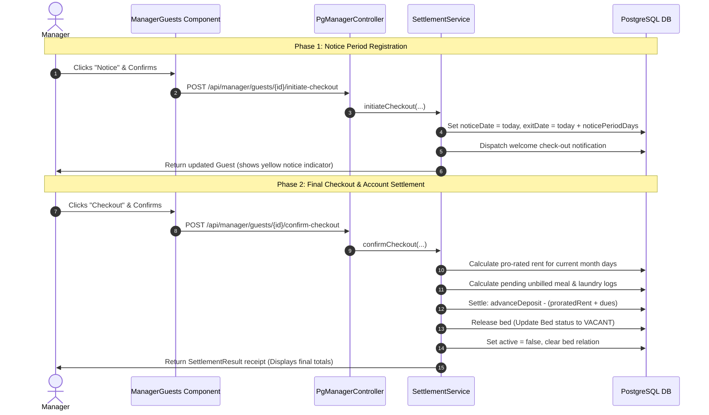

---

## 4. Meal & Add-on Tracking Flow
Tracks the daily meal preferences and add-on roster logs recorded by managers for bulk operations.

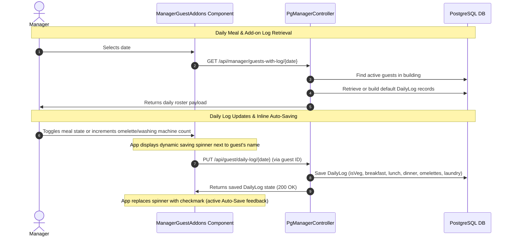

---

## 5. EB (Electricity) Bill Split Calculations
The application supports multiple bill calculation models: Equal Split across all active guests, Fixed Rate Per Bed, and Meter-Based Readings.

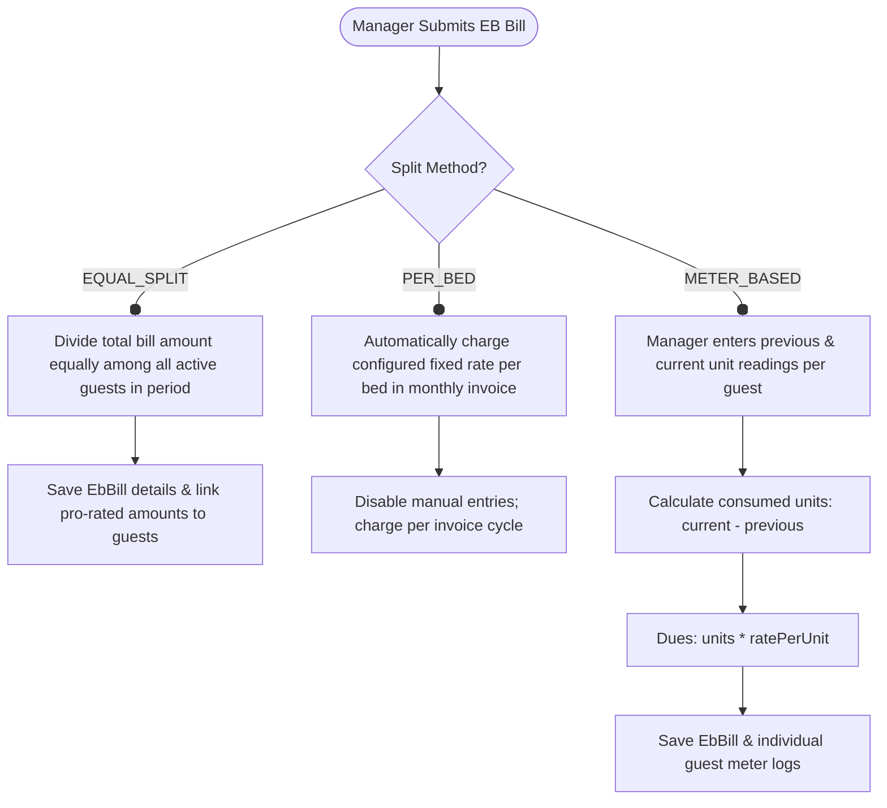

---

## 6. Invoice Generation & PDF Rendering
Billing runs either automatically via monthly cron schedules or on-demand via the manager portal.

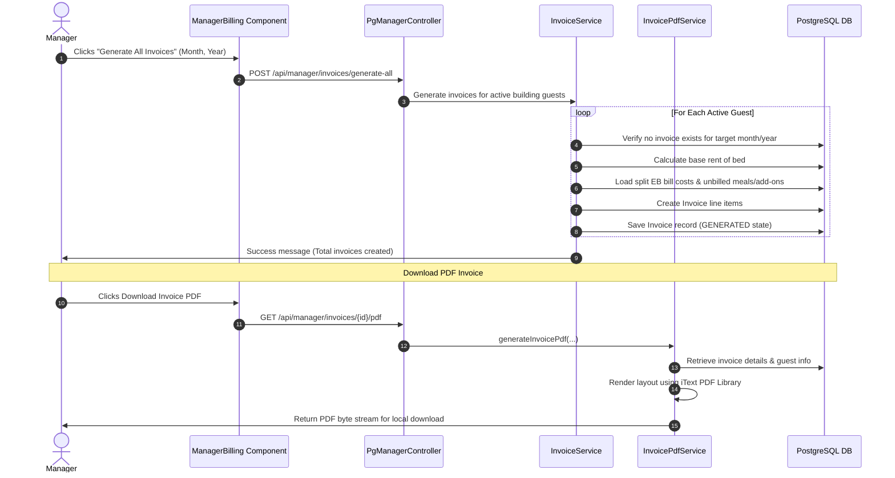

---

## 7. Guest Maintenance Portal Lifecycle
Guests submit maintenance requests from their portal. Real-time updates and status changes flow directly to the manager.

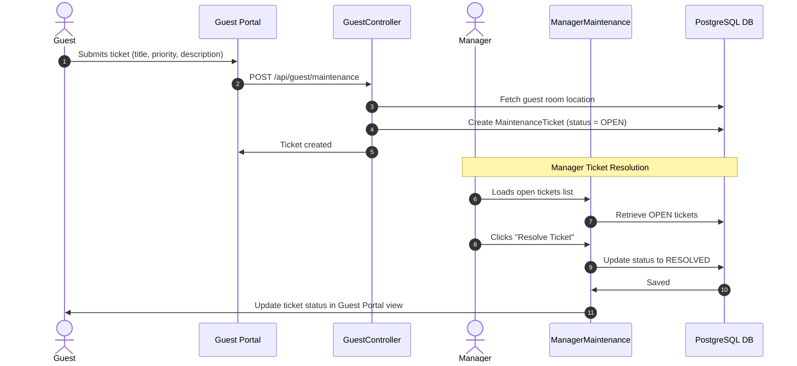

---

## 8. Audit Trail Logging System
Ensures compliance and accountability by tracking all operational administrative modifications in a permanent ledger.

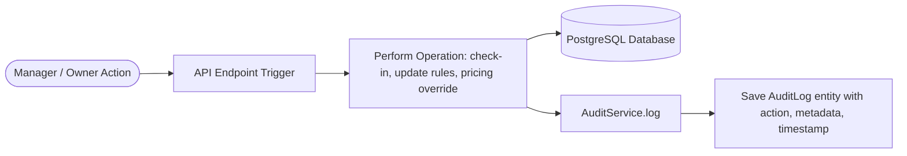

---

## 9. Building Setup & Room Inventory Creation Flow
Owners programmatically provision physical buildings, layout structures, and room configurations using a step-by-step layout wizard.

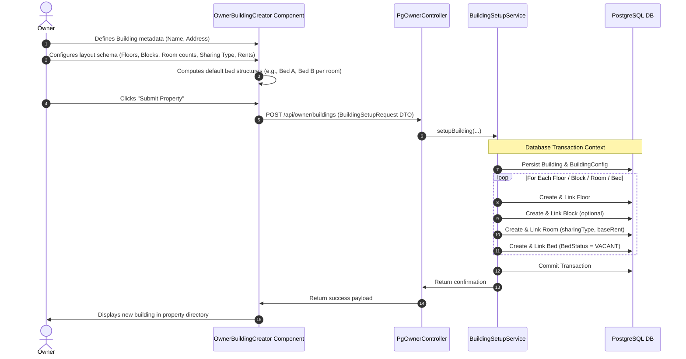

---

## 10. Manager Assignment & Branch Access Scoping Flow
Owners delegate operations by assigning managers to specific buildings, enforcing multi-branch safety scopes via JWT attributes.

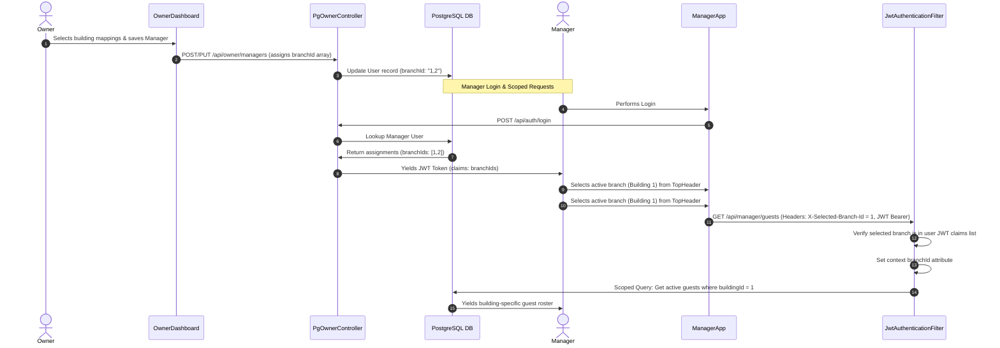

---

## 11. Dynamic Pricing Overrides & Rent Settings Flow
Enables property administrators to adjust general prices or perform bulk sharing-type rent overrides across an entire building.

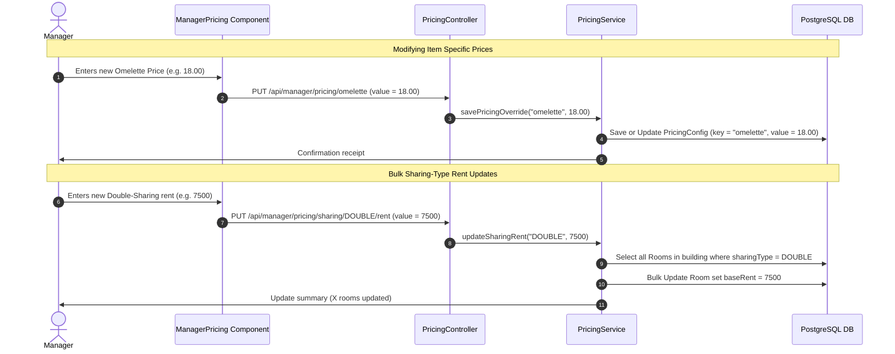

---

## 12. Calendar-Based Guest Meal Booking & Lockout Validation Flow
Guests manage future meal schedules directly from their portal, checked against strict time-based locks.

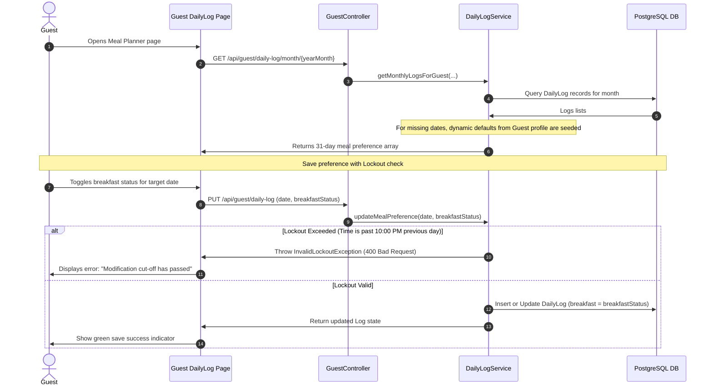

---

## 13. Razorpay Payment Processing & Webhook Verification Flow
Facilitates secure guest billing collections via payment gateway triggers, completing the invoice lifecycle.

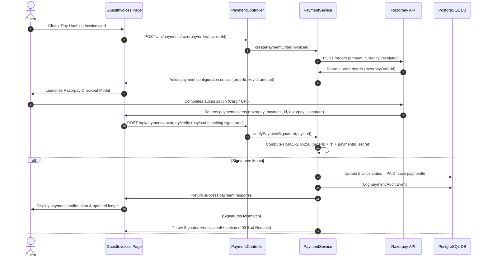

---

## 14. System Configuration & White-Label Customization Engine Flow
Dynamically loads custom system colors, logos, names, and structural preferences dynamically on load.

```mermaid
sequenceDiagram
    autonumber
    actor Client as User Browser
    participant Context as SystemConfigContext
    participant Controller as SystemConfigController
    participant Properties as SystemConfigProperties
    participant File as Filesystem (tenant-config.yml)

    Note over Properties, File: Server Startup Init
    Properties->>File: Loads tenant-config.yml configs
    Note over Properties: Falls back to Java defaults if keys are missing
    
    Note over Client, Properties: Dynamic Whitelabel Rendering
    Client->>Context: Mounts Context Provider
    Context->>Controller: GET /api/system/config
    Controller->>Properties: Retrieves active branding & rules
    Properties->>Controller: Returns Name, ShortTitle, Theme colors
    Controller->>Client: Yields SystemConfigResponse DTO
    Context->>Context: Injects custom variables into CSS Root Variables
    Note over Client: UI updates brand headers, titles, and color themes dynamically
```

---

## 15. Cron-Based Billing & Payment Reminders Automation Flow
Executes server-side batch billing pipelines on schedule, notifying residents automatically of pending balances.

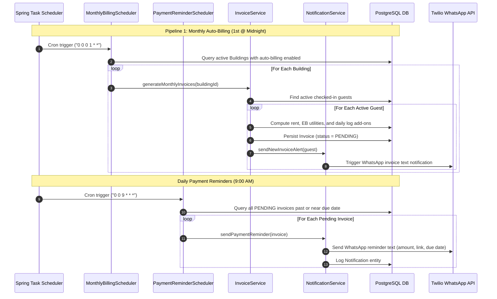

---

## 16. Guest Email Profile Change OTP Verification Flow
Secures the guest profile update pipeline, preventing unauthorized email modifications by using a 6-digit verification code.

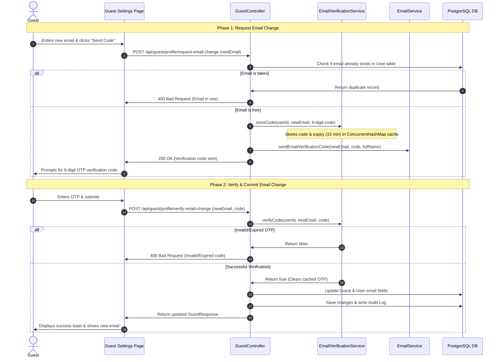

---

## 17. Forgot/Reset Password Temporary Credentials Flow
Permits self-service password recovery, issuing a random temporary password and forcing users to change it on their subsequent login.

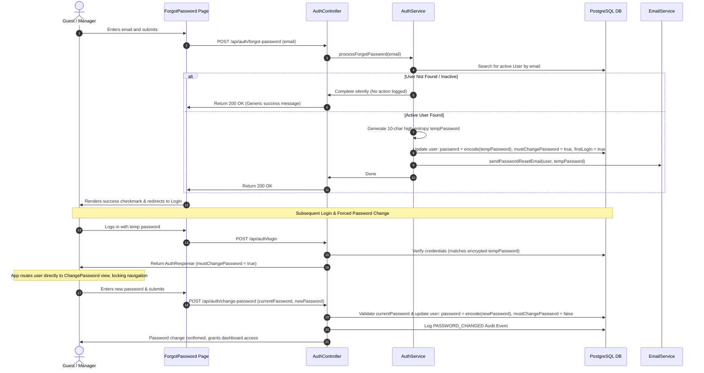

---

## 18. Room/Bed Switch & Multi-Channel Notification Flow
Handles transferring checked-in guests between rooms/beds via an interactive grid, recording audit logs, sending confirmation emails, and publishing in-app alerts.

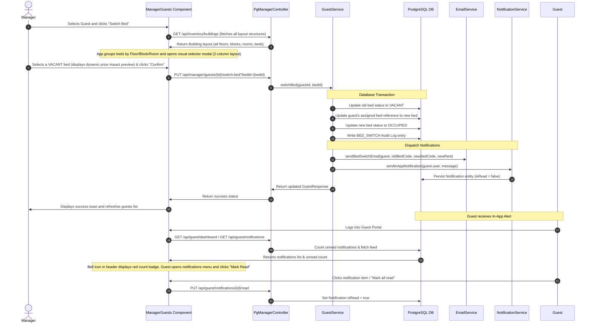

---

## 19. Guest Cash Handover & Manager Verification Flow
Enables guests to request rent verification for offline cash handovers, placing verification cards at high priority on the manager's dashboard workspace.

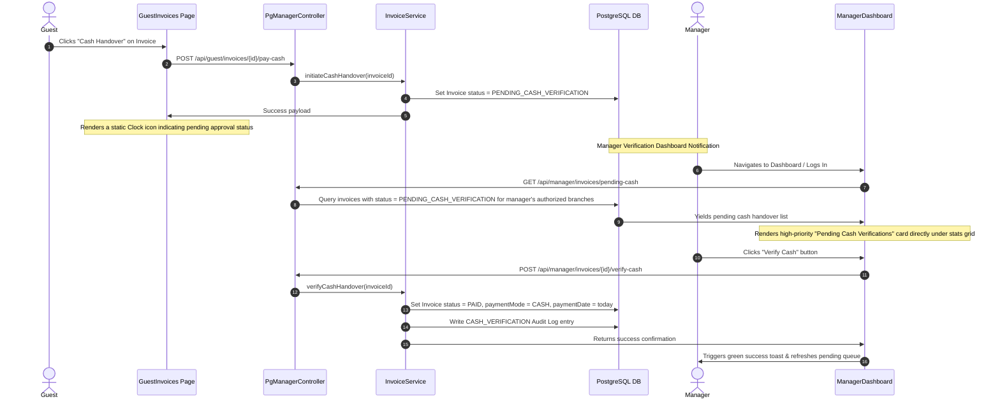

---

## 20. Guest Profile Modification & Constraint Validation Flow
Secures the guest profile update pipeline in the manager view, preventing duplicate email assignments using an in-modal validation error alert.

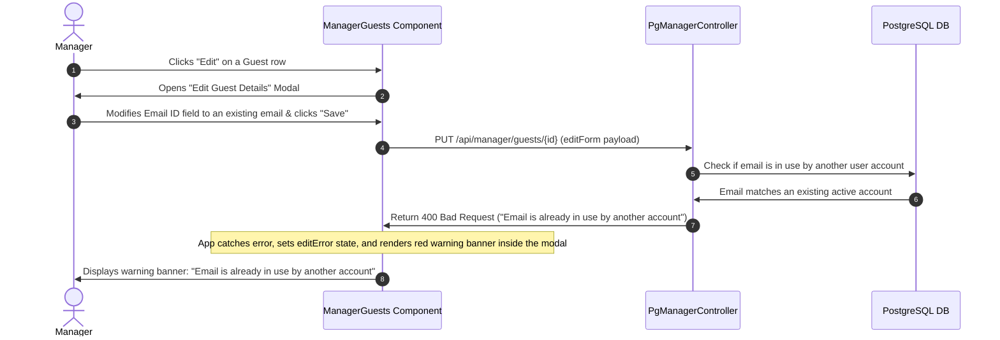

