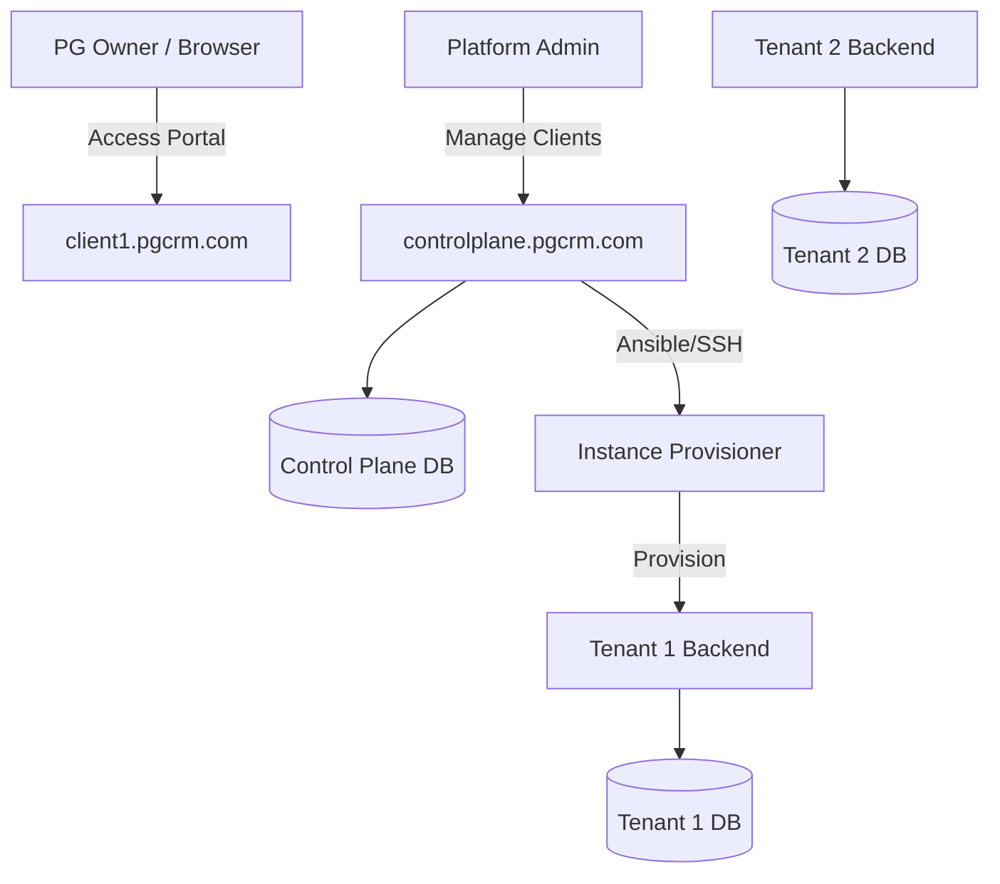

# Architecture Design Document: B2B SaaS Control Plane

This document outlines the high-level architecture, database schema, onboarding flow, and billing reminder engine for the B2B SaaS Control Plane portal. This portal is a separate administrative application designed to manage single-tenant application instances, track PG Owner subscriptions, and process payments.

---

## 1. System Topology & Architecture

The system uses a **Single-Tenant Application / Shared Control Plane** topology:
- **Control Plane**: A centralized, multi-tenant React/Spring Boot application scoped to platform administrators. It manages subscription state, invoice collection, database migrations, and provisioning records.
- **Tenant Instances**: Each client (PG Owner) gets an isolated application instance (containerized Spring Boot backend + independent React frontend hosted on a client-specific subdomain e.g., `clientname.pgcrm.com`).
- **Database Isolation**: PostgreSQL database-per-tenant isolation to satisfy data compliance, tenancy boundaries, and backup hygiene.



---

## 2. Core Database Schema

The Control Plane repository utilizes a PostgreSQL database structure. The core schema defines subscription states, tenant instances, transaction logs, and provisioning queues.

```sql
-- DDL Schema for B2B SaaS Control Plane

CREATE EXTENSION IF NOT EXISTS "uuid-ossp";

-- 1. Tenants Table
CREATE TABLE tenants (
    id UUID PRIMARY KEY DEFAULT uuid_generate_v4(),
    name VARCHAR(255) NOT NULL,
    subdomain VARCHAR(63) NOT NULL UNIQUE,
    instance_url VARCHAR(255),
    status VARCHAR(31) NOT NULL DEFAULT 'PROVISIONING', -- PROVISIONING, ACTIVE, SUSPENDED, DELETED
    owner_name VARCHAR(255) NOT NULL,
    owner_email VARCHAR(255) NOT NULL UNIQUE,
    owner_phone VARCHAR(31),
    created_at TIMESTAMP WITH TIME ZONE DEFAULT CURRENT_TIMESTAMP,
    updated_at TIMESTAMP WITH TIME ZONE DEFAULT CURRENT_TIMESTAMP
);

CREATE INDEX idx_tenant_subdomain ON tenants(subdomain);
CREATE INDEX idx_tenant_status ON tenants(status);

-- 2. Subscriptions (AMC Contracts) Table
CREATE TABLE subscriptions (
    id UUID PRIMARY KEY DEFAULT uuid_generate_v4(),
    tenant_id UUID NOT NULL REFERENCES tenants(id) ON DELETE CASCADE,
    plan_name VARCHAR(63) NOT NULL, -- e.g., BASIC, PREMIUM
    amc_amount NUMERIC(12, 2) NOT NULL,
    start_date DATE NOT NULL,
    end_date DATE NOT NULL,
    status VARCHAR(31) NOT NULL DEFAULT 'ACTIVE', -- ACTIVE, GRACE_PERIOD, EXPIRED, CANCELLED
    last_payment_date DATE,
    created_at TIMESTAMP WITH TIME ZONE DEFAULT CURRENT_TIMESTAMP,
    updated_at TIMESTAMP WITH TIME ZONE DEFAULT CURRENT_TIMESTAMP
);

CREATE INDEX idx_sub_end_date ON subscriptions(end_date);
CREATE INDEX idx_sub_status ON subscriptions(status);

-- 3. Razorpay Transactions Table
CREATE TABLE razorpay_transactions (
    id UUID PRIMARY KEY DEFAULT uuid_generate_v4(),
    tenant_id UUID REFERENCES tenants(id) ON DELETE SET NULL,
    subscription_id UUID REFERENCES subscriptions(id) ON DELETE SET NULL,
    razorpay_order_id VARCHAR(255) NOT NULL UNIQUE,
    razorpay_payment_id VARCHAR(255) UNIQUE,
    razorpay_signature VARCHAR(255),
    amount NUMERIC(12, 2) NOT NULL,
    currency VARCHAR(7) NOT NULL DEFAULT 'INR',
    status VARCHAR(31) NOT NULL DEFAULT 'INITIATED', -- INITIATED, SUCCESS, FAILED
    failure_reason TEXT,
    created_at TIMESTAMP WITH TIME ZONE DEFAULT CURRENT_TIMESTAMP
);

CREATE INDEX idx_trx_order_id ON razorpay_transactions(razorpay_order_id);

-- 4. Onboarding Tickets Table
CREATE TABLE onboarding_tickets (
    id UUID PRIMARY KEY DEFAULT uuid_generate_v4(),
    tenant_id UUID NOT NULL REFERENCES tenants(id) ON DELETE CASCADE,
    setup_transaction_id UUID NOT NULL REFERENCES razorpay_transactions(id),
    status VARCHAR(31) NOT NULL DEFAULT 'PENDING', -- PENDING, IN_PROGRESS, COMPLETED, FAILED
    assigned_to VARCHAR(255),
    notes TEXT,
    created_at TIMESTAMP WITH TIME ZONE DEFAULT CURRENT_TIMESTAMP,
    updated_at TIMESTAMP WITH TIME ZONE DEFAULT CURRENT_TIMESTAMP
);

CREATE INDEX idx_onboarding_status ON onboarding_tickets(status);
```

---

## 3. Automated Onboarding & Provisioning Flow

The onboarding sequence from the public marketing funnel through payment capture reconciliation to local deployment is structured as follows:

```mermaid
sequenceDiagram
    autonumber
    actor Owner as B2B PG Owner
    participant Landing as LandingPage.jsx (/)
    participant SignupForm as Signup Form (/signup)
    participant CP as Control Plane Backend
    participant RZP as Razorpay Gateway
    participant Script as provision_tenant.sh
    participant TenantStack as Tenant Docker Stack

    Owner->>Landing: Visits portal landing page
    Owner->>Landing: Clicks "Start Your Onboarding" / "Purchase & Provision"
    Landing->>SignupForm: Routes to /signup
    Owner->>SignupForm: Fills onboarding details (domain, owner name, email, brand)
    SignupForm->>CP: POST /api/public/checkout/initiate-order
    Note over CP: Validates subdomain availability & creates Client/TenantInstance stubs
    CP->>RZP: Creates Razorpay Order (₹15,000 Setup Fee)
    RZP-->>CP: Returns Order ID
    CP-->>SignupForm: Returns registration ID & Razorpay Order details
    SignupForm->>Owner: Renders Razorpay Checkout modal
    Owner->>RZP: Authorizes Payment (UPI/Card/NetBanking)
    RZP-->>Owner: Payment Authorized
    RZP->>CP: Webhook Callback POST /api/public/checkout/webhook/reconcile
    Note over CP: 1. Verifies HMAC-SHA256 signature<br/>2. Transition transaction to SUCCESS<br/>3. Sets TenantInstance status to PROVISIONING
    CP->>CP: Trigger Async Provisioning via ProvisioningService
    rect rgb(30, 41, 59)
        Note over CP: Invokes ProcessBuilder to run provision_tenant.sh
        CP->>Script: Execute bash scripts/provision_tenant.sh [domain] [password] [port] [email]
        Script->>Script: 1. Sanitizes database name (pgcrm_subdomain)<br/>2. Creates isolated DB via psql
        Script->>Script: 3. Creates directories under /opt/pgcrm/[domain]/deploy<br/>4. Generates unique JWT secret key
        Script->>Script: 5. Outputs custom .env configuration file<br/>6. Copies docker-compose.prod.yml template
        Script->>TenantStack: Runs docker compose up -d
        Script-->>CP: Returns Exit Code 0 (Success)
    end
    CP->>CP: 1. Update TenantInstance status to ACTIVE<br/>2. Initialize 1-year Subscription (AMC)
    CP-->>Owner: Sends onboarding email with temporary password credentials
```



---

## 4. AMC Expiry & Reminder Engine

To track Annual Maintenance Contract (AMC) expiry dates, a daily scheduled cron engine executes on the Control Plane backend.

### Reminder Schedule Rules
The scheduler identifies active subscriptions expiring in exactly 30 days, 7 days, or 1 day:

$$\text{Reminders} = \{30 \text{ Days}, 7 \text{ Days}, 1 \text{ Day}\}$$

```java
// Spring Boot Reminder Scheduler Implementation Blueprint

package com.controlplane.scheduler;

import com.controlplane.entity.Subscription;
import com.controlplane.repository.SubscriptionRepository;
import com.controlplane.service.EmailService;
import lombok.RequiredArgsConstructor;
import lombok.extern.slf4j.Slf4j;
import org.springframework.scheduling.annotation.Scheduled;
import org.springframework.stereotype.Component;

import java.time.LocalDate;
import java.util.List;

@Slf4j
@Component
@RequiredArgsConstructor
public class AmcReminderScheduler {

    private final SubscriptionRepository subscriptionRepository;
    private final EmailService emailService;

    /**
     * Executes daily at 2:00 AM to fetch and process expiring subscriptions.
     */
    @Scheduled(cron = "0 0 2 * * ?")
    public void checkAmcExpirations() {
        log.info("Starting Daily AMC Expiration Check task...");

        LocalDate today = LocalDate.now();
        LocalDate d30 = today.plusDays(30);
        LocalDate d7 = today.plusDays(7);
        LocalDate d1 = today.plusDays(1);

        // Fetch subscriptions expiring on target date milestones
        processRemindersForDate(d30, 30);
        processRemindersForDate(d7, 7);
        processRemindersForDate(d1, 1);

        // Handle active subscriptions that passed end_date without renewal
        handleExpiredContracts(today);

        log.info("Daily AMC Expiration Check completed.");
    }

    private void processRemindersForDate(LocalDate targetDate, int daysRemaining) {
        List<Subscription> expiring = subscriptionRepository.findActiveExpiringOn(targetDate);
        log.info("Found {} subscription(s) expiring in {} days (Date: {})", expiring.size(), daysRemaining, targetDate);

        for (Subscription sub : expiring) {
            try {
                emailService.sendAmcRenewalReminderEmail(sub, daysRemaining);
                log.info("Dispatched {}-day renewal reminder email to tenant: {}", daysRemaining, sub.getTenant().getName());
            } catch (Exception e) {
                log.error("Failed to send AMC renewal email for tenant: {}. Reason: {}", sub.getTenant().getName(), e.getMessage());
            }
        }
    }

    private void handleExpiredContracts(LocalDate today) {
        List<Subscription> expired = subscriptionRepository.findActiveExpiredBefore(today);
        for (Subscription sub : expired) {
            log.warn("Subscription for tenant {} has expired on {}", sub.getTenant().getName(), sub.getEndDate());
            sub.setStatus("EXPIRED");
            sub.getTenant().setStatus("SUSPENDED");
            subscriptionRepository.save(sub);
            
            // Notify tenant owner of service suspension
            emailService.sendServiceSuspensionEmail(sub);
        }
    }
}
```

### Expiry Query logic (Repository Mappings)
```java
// JPA Repository Interface for Subscriptions

package com.controlplane.repository;

import com.controlplane.entity.Subscription;
import org.springframework.data.jpa.repository.JpaRepository;
import org.springframework.data.jpa.repository.Query;
import org.springframework.data.repository.query.Param;
import org.springframework.stereotype.Repository;

import java.time.LocalDate;
import java.util.List;

@Repository
public interface SubscriptionRepository extends JpaRepository<Subscription, String> {

    @Query("SELECT s FROM Subscription s JOIN FETCH s.tenant t WHERE s.status = 'ACTIVE' AND s.endDate = :targetDate")
    List<Subscription> findActiveExpiringOn(@Param("targetDate") LocalDate targetDate);

    @Query("SELECT s FROM Subscription s JOIN FETCH s.tenant t WHERE s.status = 'ACTIVE' AND s.endDate < :today")
    List<Subscription> findActiveExpiredBefore(@Param("today") LocalDate today);
}
```

---

## 5. Technology Stack & Key APIs

### Tech Stack
- **Backend**: Java 17, Spring Boot 3.x, Spring Data JPA, Spring Security (JWT), flyway-core.
- **Frontend**: React 18, Vite, Tailwind CSS, Lucide React (Admin Dashboard).
- **Database**: PostgreSQL 15+.
- **Payment Integration**: Razorpay Java SDK (`razorpay-java:1.4.x`).

### Key Control Plane Rest APIs

| Endpoint | Method | Role | Description |
| :--- | :--- | :--- | :--- |
| `/api/onboarding/signup` | `POST` | Public | Accepts setup registrations, generates tenant stub, and creates Razorpay Order. |
| `/api/onboarding/verify` | `POST` | Public | Verifies setup Razorpay signature, creates transaction record, and opens provisioning ticket. |
| `/api/admin/tenants` | `GET` | Admin | Fetches list of B2B clients, their subdomains, statuses, and instances. |
| `/api/admin/tenants/{id}/suspend` | `POST` | Admin | Manually suspends a B2B tenant instance (stops container/revokes access). |
| `/api/admin/onboarding/tickets` | `GET` | Admin | Lists active/pending/completed provisioning status tickets. |
| `/api/billing/renew-amc` | `POST` | Tenant Owner | Generates an AMC renewal Razorpay order for an existing B2B tenant. |
| `/api/billing/verify-amc` | `POST` | Tenant Owner | Verifies payment for AMC renewal and updates subscription `end_date` by +1 year. |
