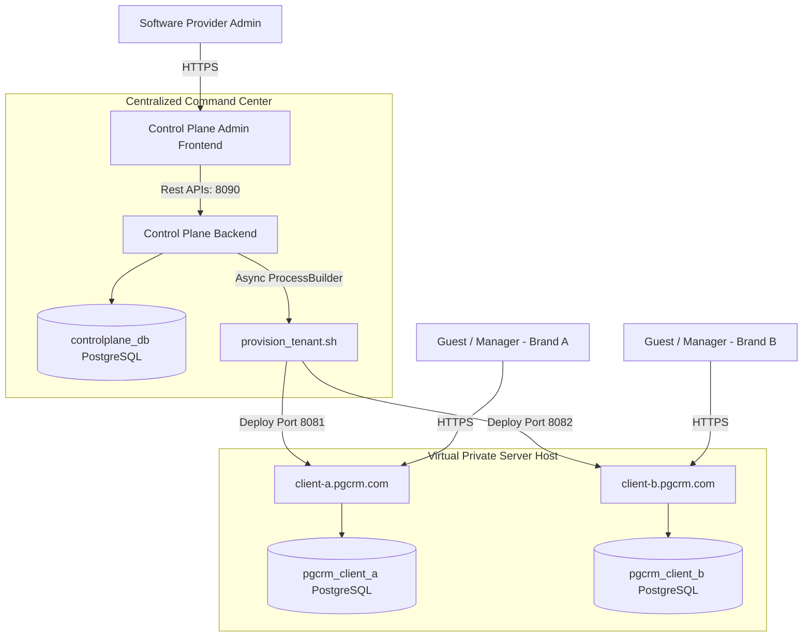

# Monorepo SaaS Architecture & Tenant Lifecycle
### Systems Architecture Reference for PG CRM B2B SaaS

This document defines the architectural relationship between the B2B SaaS **`[CONTROL-PLANE]`** command center and the white-labeled, single-tenant **`[PG-CORE]`** instances, detailing the end-to-end client onboarding workflow, billing integrations, and subscription enforcement engines.

---

## 1. Tenancy Model: Shared Control Plane vs. Isolated Single-Tenant

The PG CRM ecosystem employs a **Hybrid Multi-Instance Single-Tenant Database Isolation** model. Instead of storing multiple clients' records in a shared database schema with a tenant discriminator column, the architecture physically separates data layers.



### 1.1 Central Control Plane
* **Purpose**: Operates as a centralized SaaS ledger. It acts as the "brain" for registration, billing collection, metrics tracking, and instance orchestration.
* **Component Directory**: `/master-control-plane/`
* **Port Mapping**: Backend runs on `8090`, Admin Frontend runs on `5176`.
* **State Management**: Persists client accounts, tenant instances metadata, master payments records, and automated deployment tickets in `controlplane_db`.

### 1.2 Isolated Tenant Instances
* **Purpose**: Serves as the operational portal for individual PG brands. Each customer (e.g. PG Owner) is completely siloed.
* **Component Directory**: `/core-pg-crm/`
* **Instance Structure**: Each client runs a containerized Spring Boot backend (mapped to an isolated Postgres container database) and a static React SPA served on a unique port.
* **Benefits**:
  * **Data Privacy**: No cross-tenant query contamination.
  * **Backup Autonomy**: Customers can back up or export their exact PostgreSQL tables without database-wide service interruption.
  * **Customization**: Individual configs (color tokens, WhatsApp templates) can be adjusted without risking system-wide side-effects.

---

## 2. End-to-End Onboarding & Provisioning Lifecycle

New client acquisition is fully automated from the public checkout form through payment verification to local Docker deployment.

```mermaid
sequenceDiagram
    autonumber
    actor Owner as B2B PG Owner
    participant Landing as LandingPage.jsx (/)
    participant SignupForm as Signup Form (/signup)
    participant Backend as Control Plane Backend
    participant Razorpay as Razorpay API Gateway
    participant Script as provision_tenant.sh
    participant TenantStack as Tenant Docker Stack

    Owner->>Landing: Visits portal landing page
    Owner->>Landing: Clicks "Start Your Onboarding" / "Purchase & Provision"
    Landing->>SignupForm: Routes to /signup
    Owner->>SignupForm: Fills onboarding details (domain, owner name, email, brand)
    SignupForm->>Backend: POST /api/public/checkout/initiate-order
    Note over Backend: Validates subdomain availability & creates Client/TenantInstance stubs
    Backend->>Razorpay: Creates Razorpay Order (₹15,000 Setup Fee)
    Razorpay-->>Backend: Returns Order ID
    Backend-->>SignupForm: Returns registration ID & Razorpay Order details
    SignupForm->>Owner: Renders Razorpay Checkout modal
    Owner->>Razorpay: Authorizes Payment (UPI/Card/NetBanking)
    Razorpay-->>Owner: Payment Authorized
    Razorpay->>Backend: Webhook Callback POST /api/public/checkout/webhook/reconcile
    Note over Backend: 1. Verifies HMAC-SHA256 signature<br/>2. Transition transaction to SUCCESS<br/>3. Sets TenantInstance status to PROVISIONING
    Backend->>Backend: Trigger Async provisionNewTenant()
    rect rgb(30, 41, 59)
        Note over Backend: Invokes ProcessBuilder to run provision_tenant.sh
        Backend->>Script: Execute bash scripts/provision_tenant.sh [domain] [password] [port] [email]
        Script->>Script: 1. Sanitizes database name (e.g. pgcrm_subdomain)<br/>2. Creates isolated DB via psql
        Script->>Script: 3. Creates directories under /opt/pgcrm/[domain]/deploy<br/>4. Generates unique JWT secret key
        Script->>Script: 5. Outputs custom .env configuration file<br/>6. Copies docker-compose.prod.yml template
        Script->>TenantStack: Runs docker compose up -d
        Script-->>Backend: Returns Exit Code 0 (Success)
    end
    Backend->>Backend: 1. Update TenantInstance status to ACTIVE<br/>2. Initialize 1-year Subscription (AMC)
    Backend-->>Owner: Sends onboarding email with temporary password credentials
```



### 2.1 Webhook Reconciliation & Signature Verification
* Handled in `CheckoutServiceImpl.java`.
* Incoming webhook payload from Razorpay is cryptographically verified against the configured webhook secret:
  $$\text{Expected Signature} = \text{HMAC-SHA256}(\text{payload}, \text{secret})$$
* If signatures match, the payment is logged, and the provisioning queue is triggered.

### 2.2 Provisioning Orchestration
* `ProvisioningService.java` identifies the next free host port (starting at `8081`).
* It spins up a shell process calling `scripts/provision_tenant.sh` with parameter bindings:
  ```bash
  bash scripts/provision_tenant.sh <domain_name> <db_password> <app_port> <client_email>
  ```
* Output stream is piped directly into Spring Boot log framework prefixed with `[PROVISIONING SCRIPT]`.

---

## 3. Annual Maintenance Contract (AMC) & Subscription Engine

Subscriptions are billed using the **Hybrid Asset Model**: a one-time setup fee followed by an annual contract.

### 3.1 Automated Reminder Scheduler
A daily cron job in the Control Plane checks for upcoming expirations to prompt timely renewals.
* **Class**: `AmcReminderScheduler.java`
* **Execution Interval**: Daily at 2:00 AM (`0 0 2 * * ?`)
* **Milestone Logic**:
  * Scans for subscriptions expiring in **exactly 30 days, 7 days, and 1 day** using `SubscriptionRepository.findActiveExpiringOn()`.
  * Calls `EmailService.sendAmcRenewalReminderEmail` to warn the tenant owner of the upcoming expiration.

### 3.2 Suspension Enforcement
* If a subscription's expiration date passes today without payment, the scheduler fetches it using `findActiveExpiredBefore(LocalDate.now())`.
* The system transitions:
  * `Subscription.licenseState` $\rightarrow$ `LicenseState.EXPIRED`
  * `TenantInstance.status` $\rightarrow$ `TenantStatus.SUSPENDED`
* Triggers `EmailService.sendServiceSuspensionEmail` to alert the client that their portal access is suspended.

### 3.3 Renewal API Workflow
Clients can renew their subscription directly from the Client Billing Dashboard:
1. Client logs into the Control Plane Billing Portal and requests renewal.
2. React frontend hits `POST /api/billing/renew-amc`.
3. Control Plane Backend creates a new Razorpay Order for ₹35,000 and registers the transaction.
4. Upon successful payment verification on `/api/billing/verify-amc`, the subscription is updated:
   $$\text{New Expiry Date} = \text{Current Expiry Date} + 1 \text{ Year}$$
   `Subscription.licenseState` is reset to `LicenseState.ACTIVE`, and `TenantInstance.status` is reset to `TenantStatus.ACTIVE`.
