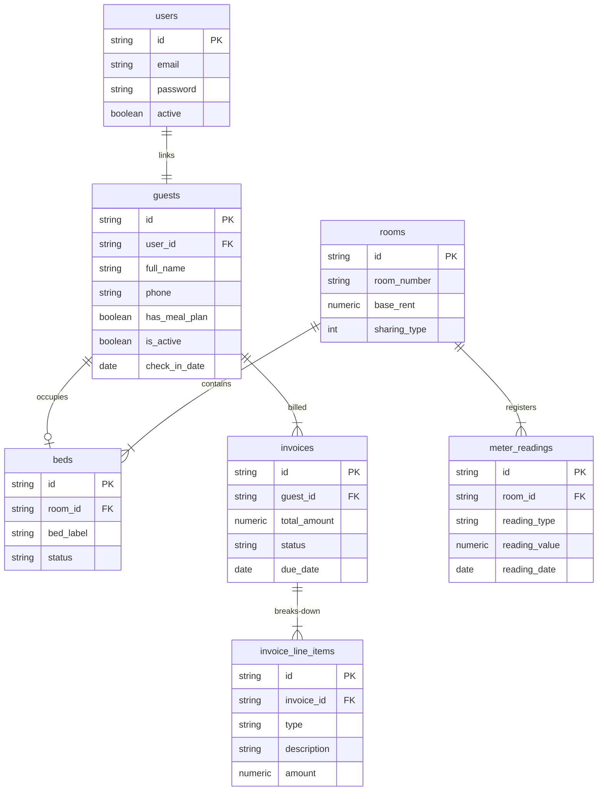

# Proof of Concept (POC) Specification: PG CRM B2B SaaS Ecosystem

This Proof of Concept (POC) document details the end-to-end architecture, database structures, core business logic modules, and deployment setup for the **PG CRM B2B SaaS Ecosystem**. 

---

## 1. Executive Summary

The PG CRM ecosystem is a white-labeled, B2B SaaS monorepo designed for Paying Guest (PG) and hostel operators. The platform is architected around a **hybrid tenancy model** that combines a centralized billing/provisioning engine with isolated single-tenant property instances. This ensures client-level data separation (preventing leaks of PII or financials) while providing centralized administration.

---

## 2. Decoupled Architecture Mappings

The monorepo separates customer-facing property operations from B2B tenant provisioning:

```
                                  +---------------------------------------+
                                  |     Central SaaS Control Plane        |
                                  |    (B2B Management & Billing)         |
                                  +---------------------------------------+
                                                      |
                             [Triggers Automated Docker Instance Spawn]
                                                      |
                                                      v
      +---------------------------------------------------------------------------------------+
      |                                  Single-Tenant Instances                              |
      +---------------------------------------------------------------------------------------+
      |  🏢 Sri Sai PG Core Instance            |   🏢 Das PG Core Instance                     |
      |  - vite + react (Port 5173)             |   - vite + react (Port 5174)                  |
      |  - spring boot api (Port 8080)          |   - spring boot api (Port 8081)               |
      |  - PostgreSQL Database (pgcrmdb_sai)   |   - PostgreSQL Database (pgcrmdb_das)         |
      +---------------------------------------------------------------------------------------+
```

### A. Core Property Engine (`[PG-CORE]`)
* **Path**: `/core-pg-crm/`
* **Port Mappings**: Backend on `8080`, Frontend on `5173`.
* **Scope**: Daily property operations (Check-in, Bulk Uploads, Sub-Meter EB calculations, Kitchen meal planners, Maintenance tickets, and Checkout settlements).
* **Isolation**: Each property brand runs its own Docker container stack pointing to a dedicated PostgreSQL database.

### B. SaaS Command Center (`[CONTROL-PLANE]`)
* **Path**: `/master-control-plane/`
* **Port Mappings**: Backend on `8090`, Frontend on `5176`.
* **Scope**: Client onboarding, Razorpay payment verification, platform subscriptions, and automated Docker instance shell-scripts triggering.

---

## 3. High-Value Operational Modules

### 3.1 1-Click Excel Bulk Onboarding Engine
Instantly registers hundreds of rooms, beds, and guests from a standard Excel sheet. 
* **Self-Healing Provisioning**: Floor layouts and rooms are automatically created if missing. Rooms are pre-provisioned with standard beds (`-A` and `-B`).
* **Dynamic Capacity Expansion**: If a room is full during guest assignment, it dynamically appends a new capacity bed (e.g., `-C`, `-D`) to avoid import crashes.
* **Historical SaaS Migration**: Parses three optional columns:
  * **Opening Rent Arrears**: Auto-generates an unpaid baseline `Invoice` and associated `RENT` line item.
  * **Initial EB Reading**: Registers the room's migration sub-meter baseline in the `meter_readings` table.
  * **Meal Plan Opt-In**: Configures default food preferences on the guest profile.

### 3.2 Flat-Rate Fixed Rent Model (Option A)
* **Standard Monthly Billing**: If a guest is active for any portion of the billing month, they are charged their full fixed monthly rent. Daily pro-rations are bypassed.
* **Whole Room Bookings**: If a guest occupies an entire room (`isBookEntireRoom = true`), the billing engine multiplies the monthly rent by the room's capacity:
  $$\text{Adjusted Rent} = \text{guest.getMonthlyRent()} \times \text{guest.getRoom().getSharingType()}$$
* **Checkout Settlements (Option A)**: Guests exiting mid-month are charged the full month's flat-rate rent for their exit month, eliminating partial checkout discounts.

### 3.3 Electricity (EB) Split Engine
Divided into three structural methods:
* **Equal Split**: Consumed units are calculated across the building and split equally among all active residents during the billing period.
* **Per-Bed Fixed Rate**: Charges a static flat fee per bed every month.
* **Sub-Meter Reading**: Calculates consumption directly at the room level:
  $$\text{Dues} = (\text{Current Reading} - \text{Previous Reading}) \times \text{Rate Per Unit}$$

### 3.4 PII Anonymization Compliance Engine (3:00 AM Cron)
Automates GDPR/Data Governance rules. Every 24 hours, a scheduled Spring Task retrieves guests who checked out over 365 days ago. It scrubs personally identifiable information (replacing names, emails, and phone numbers with random strings) while keeping the database row intact. This preserves the absolute integrity of financial and occupancy records.

---

## 4. Unified Data Schema



---

## 5. System Execution Quickstart

### 5.1 Local Database Provisioning
Configure a local PostgreSQL 18 instance and create the target databases:
```sql
CREATE DATABASE pgcrmdb;          -- Targets single-tenant PG-CORE
CREATE DATABASE controlplane_db;  -- Targets CONTROL-PLANE SaaS manager
```

### 5.2 Compile & Run Instructions

#### A. Run `[PG-CORE]`
```bash
# Compile and Start Backend
cd core-pg-crm/backend
mvn spring-boot:run -Dspring.profiles.active=dev

# Start Frontend Dev Server
cd ../frontend
npm install
npm run dev
```

#### B. Run `[CONTROL-PLANE]`
```bash
# Compile and Start Backend Central SaaS
cd master-control-plane/backend
mvn spring-boot:run -Dspring.profiles.active=dev

# Start Admin Dashboard
cd ../frontend
npm install
npm run dev
```

---

## 6. SaaS Production Instance Provisioning Pipeline

The SaaS control plane programmatically instantiates new property instances on-demand via a script pipeline:

```bash
#!/bin/bash
# scripts/provision_tenant.sh
# Usage: ./provision_tenant.sh [tenant_id] [assigned_port] [database_name]

TENANT_ID=$1
PORT=$2
DB_NAME=$3

echo "Provisioning Single-Tenant Instance: $TENANT_ID on Port $PORT..."

# 1. Initialize dedicated database schema
psql -U postgres -c "CREATE DATABASE $DB_NAME;"

# 2. Run Containerized Spring Boot + React instance mapped to custom port
docker run -d \
  --name "pgcrm_core_$TENANT_ID" \
  -p "$PORT:8080" \
  -e "SPRING_DATASOURCE_URL=jdbc:postgresql://db:5432/$DB_NAME" \
  -e "SPRING_PROFILES_ACTIVE=prod" \
  pgcrm-core-image:latest

echo "Instance $TENANT_ID successfully deployed."
```
This script is triggered by B2B SaaS webhooks upon payment capture, facilitating automated onboarding of property operators.
