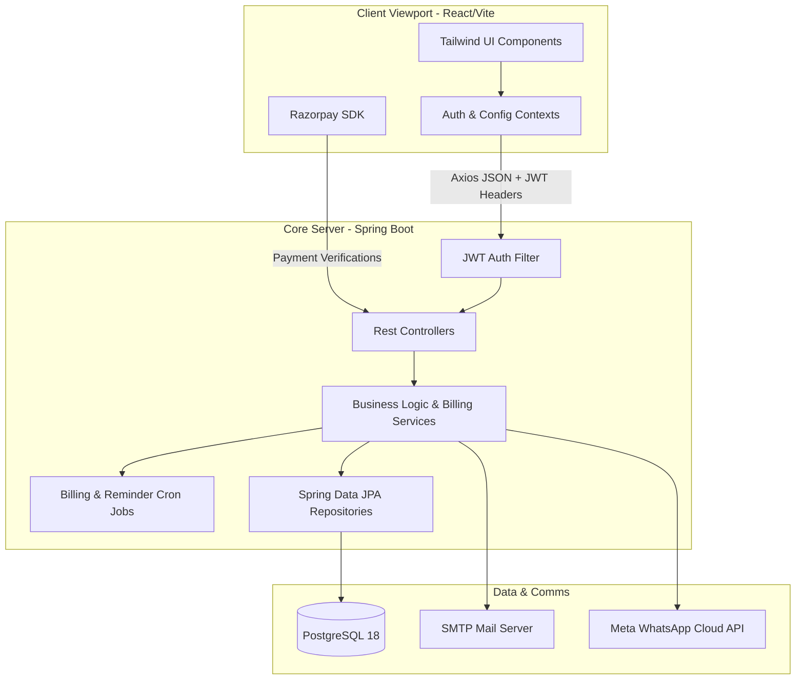
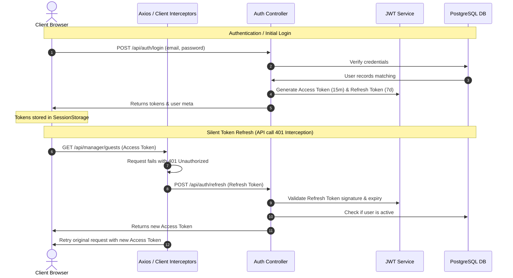
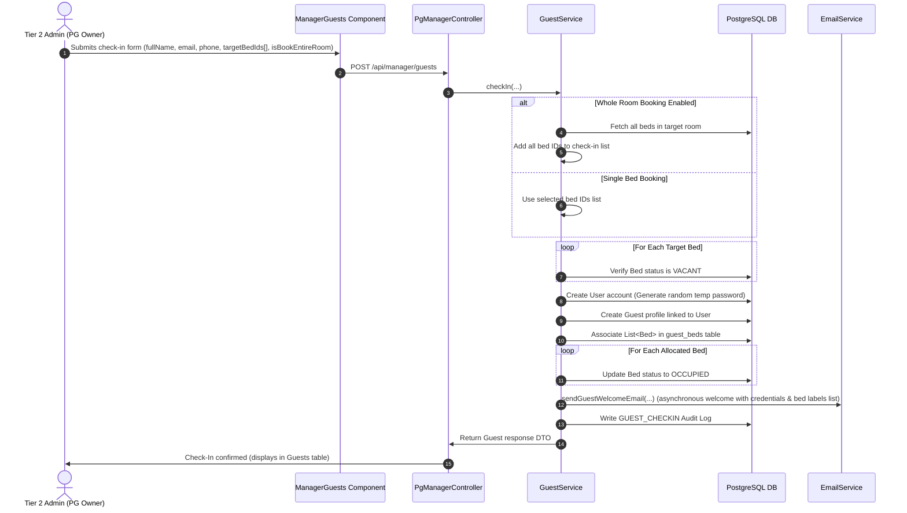
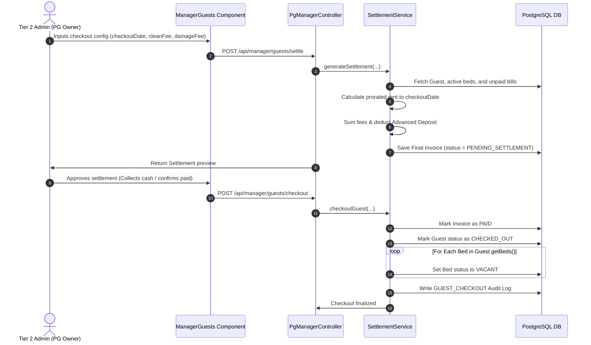
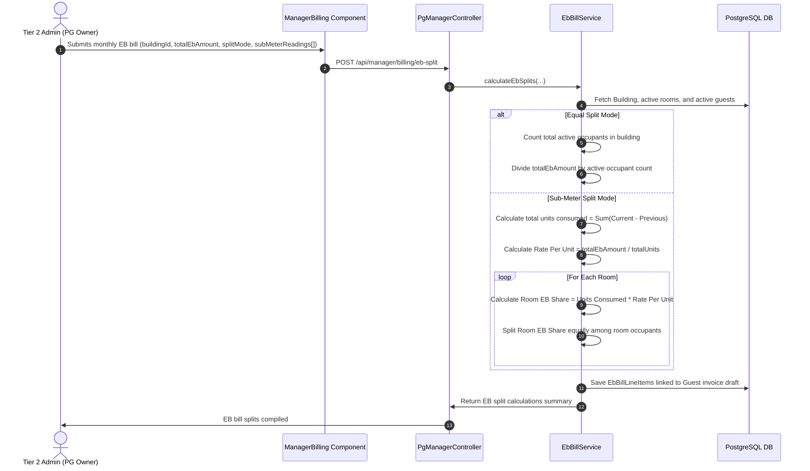
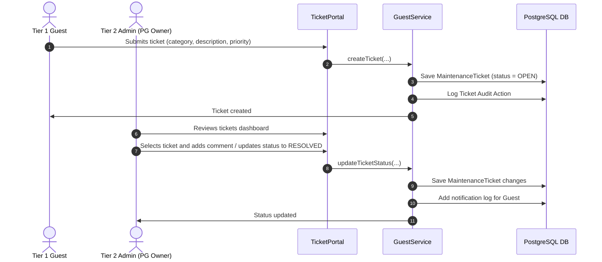
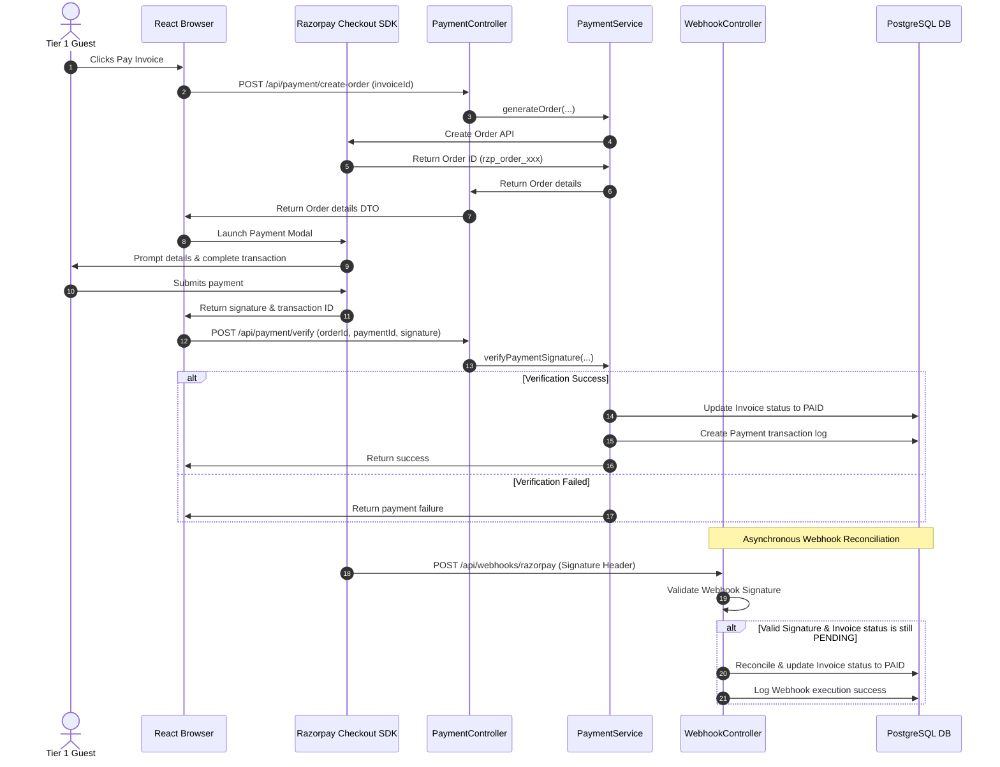

# PG CRM: Comprehensive System Reference Manual
### Official Technical Reference for Architecture, Workflows, Calculations, and Deployment

This document serves as the unified, single source of truth for the PG CRM Paying Guest and Hostel Management Platform. It compiles all system architectures, database mappings, role hierarchies, mathematical billing engines, workflow sequence guides, environment profiles, and client onboarding standard operating procedures (SOP) into a single, cohesive document.

---

## 1. Architectural Pillars & Core Tech Stack

PG CRM is designed around a strictly decoupled client-server model engineered to support rapid white-labeled provisioning, secure single-tenant database isolation, dynamic business rules execution, and robust multi-channel logging.

### 1.1 Architectural Pillars

* **Single-Tenant Data Isolation**: To ensure maximum data privacy and ease compliance audits, each client/hostel branch is deployed on an isolated infrastructure stack with its own PostgreSQL instance. There are no shared database schemas, preventing cross-tenant leakage.
* **White-Labeling & Branding Engine**: System branding (full name, short title, primary color) is driven dynamically via `tenant-config.yml` at boot. Frontend components fetch these settings dynamically, adjusting themes and browser metadata without requiring backend rebuilds.
* **Dynamic Rules Engine**: Property-specific default prices, meal lockout cutoffs, allowed payment models, and utility billing models are persisted in the database via the `BuildingConfig` model, allowing administrators to modify operations on the fly.
* **Multi-Channel Notifications**: Real-time push updates are stored in database logs and served via interactive client notification hubs. Automated email (SMTP) and WhatsApp messages (Meta Cloud API) keep residents updated.
* **Observability Pipelines**: Logging is built on Lombok `@Slf4j` annotations across all layers (Controller, Service, Repository, Security, and Scheduler), maintaining a strict logging audit trail for transactions, authentication failures, and background jobs.

### 1.2 Core Tech Stack



* **Backend**: Java 23, Spring Boot 3.2.5, Spring Security, Spring Data JPA, Hibernate, Flyway (DB migrations), MapStruct (object mapping), and PostgreSQL 18.
* **Frontend**: React 18, Vite (build compiler), Tailwind CSS (branding styling), Axios (authenticated HTTP requests), and Razorpay SDK (payment checkout gateway).

---

## 2. Four-Tier Role Hierarchy & Access Scopes

The system implements a strict Role-Based Access Control (RBAC) structure. Request authorization is verified dynamically on the backend via JWT claims on every REST endpoint.

| Tier | Platform Role | Database Role Enum | Access Scope & Responsibilities |
| :--- | :--- | :--- | :--- |
| **Tier 1** | **Guest** | `GUEST` | **Resident Portal Access**. Residents can log in to view their checking-in details, meal calendars, monthly billing invoices, payment transaction histories, and submit/track maintenance requests. |
| **Tier 2** | **Admin (PG Owner)** | `PG_MANAGER` | **Property Branch Administration**. Managers handle guest check-ins, record daily add-on consumptions, input utility sub-meter readings, trigger monthly bill runs, manage maintenance tickets, and accept cash settlements. |
| **Tier 3** | **Super Admin (Owner's Super Admin)** | `PG_OWNER` | **Global Administration**. Enterprise owners register property branches (buildings, floors, rooms, beds), manage Tier 2 Admin accounts, adjust dynamic rule configurations, and view global revenue analytics. |
| **Tier 4** | **Super Super Admin (Software Provider)** | *(System Level)* | **Host & Infrastructure Operations**. System providers configure server environments, manage container orchestration templates, adjust whitelabel token custom parameters, and maintain SSL proxy routing. |

---

## 3. File Architecture & Codebase Registry

The following section maps the directory structure of the repository, documenting the exact purpose and UI/database interaction of every core file.

### 3.1 Backend Registry (`com.pgcrm`)

```
backend/src/main/java/com/pgcrm/
├── config/             # Environment, Jackson, and Twilio setups
├── dto/                # REST Data Transfer Objects (Request/Response)
├── entity/             # JPA Database Entities
├── exception/          # Global and Domain Exception handlers
├── controller/         # REST Controllers exposing API endpoints
├── repository/         # Spring Data JPA Repository interfaces
├── service/            # Business Logic implementation classes
├── security/           # JWT filter and Spring Security context rules
├── seeder/             # Initial system database seed scripts
└── scheduler/          # Monthly billing & payment reminder crons
```

#### Config Package (`com.pgcrm.config`)
* `JacksonConfig.java`: Configures custom `ObjectMapper` modules. Solves Java 8 date/time serialization issues (`LocalDate`, `LocalDateTime`) between backend responses and the React client.
* `SystemConfigProperties.java`: Externalizes dynamic properties. Maps branding attributes (`name`, `short-title`, `primary-color`) loaded from host files to system configurations.
* `TwilioConfig.java`: Binds third-party Twilio variables (account SIDs, authorization tokens, source phone numbers) used by notification dispatch scripts.

#### DTO Package (`com.pgcrm.dto`)
* `AuthRequest.java`: Securely binds incoming credentials (`email`, `password`) for authentication checks.
* `AuthResponse.java`: Formats authentication success payloads, encapsulating JWT tokens, role scopes, and the `mustChangePassword` security flag.
* `GuestCheckInRequest.java`: Transports checked-in configurations (deposit, room allocations, check-in dates, meal settings, and assigned bed lists) from the manager dashboard.
* `GuestResponse.java`: Formats active guest profiles, building allocations, and structural bed labels for frontend UI presentation.
* `InvoiceResponse.java`: Compiles invoice statements, billing line items, payment status, and due dates.
* `SystemConfigResponse.java`: Exposes public branding values and dynamic rules configuration to frontend contexts.

#### Exception Package (`com.pgcrm.exception`)
* `ResourceNotFoundException.java`: Intercepts calls for non-existent database identifiers (e.g. invalid Bed ID or Guest ID), returning HTTP `404 Not Found`.
* `BedUnavailableException.java`: Triggered when checking in a guest to a bed that is not currently marked as `VACANT`, returning HTTP `400 Bad Request`.
* `InvalidLockoutException.java`: Prevents guests from editing meal calendars after cutoff times, returning HTTP `400 Bad Request`.
* `SignatureVerificationException.java`: Dispatched when incoming third-party webhooks (e.g., Razorpay callbacks) fail header cryptographic signatures.

#### Controller Package (`com.pgcrm.controller`)
* `AuthController.java`: Entry points for user sessions. Directs login authentication, token refresh requests, password recoveries, and password resets.
* `GlobalExceptionHandler.java`: Intercepts runtime errors across the application, converting exceptions into clean, formatted JSON payloads for client UI alerts.
* `GuestController.java`: Self-service portal endpoints for Tier 1 Guests. Handles profile adjustments, meal planning, and maintenance ticket registrations.
* `InventoryController.java`: Serves occupancy layouts. Resolves hierarchical building maps (building $\rightarrow$ floors $\rightarrow$ rooms $\rightarrow$ beds) for property administration.
* `PaymentController.java`: Manages financial payments. Integrates with Razorpay checkout gateways and manual cash log updates.
* `PgManagerController.java`: Manager operations for Tier 2 Admins. Houses check-in pipelines, bed switches, checkout notices, daily log edits, and EB split logs.
* `PgOwnerController.java`: Owner operations for Tier 3 Super Admins. Manages manager profiles, building structures, and business reports.
* `PricingController.java`: Handles pricing configurations, updating rate sheets (rent, meal, utility bases) dynamically.
* `PublicConfigController.java`: Exposes branding properties (`name`, `shortName`, `primaryColor`) publicly without requiring JWT authentication.

#### Entity Package (`com.pgcrm.entity`)
* `User.java`: Stores basic login accounts, email credentials, BCrypt hashes, active security roles, and password flags.
* `Guest.java`: Represents active residents. Tracks security deposits, checkout statuses, default preferences, and links to multiple beds via `@ManyToMany` mappings.
* `Building.java` & `Floor.java` & `Room.java` & `Bed.java`: Represents the physical property. Beds track statuses (`VACANT`, `OCCUPIED`, `UNDER_NOTICE`).
* `BuildingConfig.java`: Stores rules configuration (lockout times, payment configurations, utility billing formulas).
* `Invoice.java` & `InvoiceLineItem.java`: Records billing statements and line items (rent, utilities, food logs).
* `DailyLog.java`: Logs daily occurrences of consumable items (breakfast, lunch, dinner, laundry).
* `Payment.java`: Models transactions, capturing transaction IDs, modes, and settlement dates.
* `MaintenanceTicket.java`: Tracks maintenance requests (priority status, descriptions, manager comments).
* `AuditLog.java`: Audit trail tracking operations (e.g. `GUEST_CHECKIN`, `BED_SWITCH`, `GUEST_CHECKOUT`).

#### Repository Package (`com.pgcrm.repository`)
* Exposes standard database CRUD operations utilizing Spring Data JPA (e.g. `UserRepository`, `GuestRepository`, `BedRepository`, `InvoiceRepository`, `PaymentRepository`, `MaintenanceTicketRepository`).

#### Service Package (`com.pgcrm.service`)
* `AuthService.java`: Evaluates credentials, checks BCrypt passwords, and processes password changes.
* `GuestService.java`: Orchestrates checking-in guests (account provisioning, bed allocations, welcome logs) and bed switching.
* `InvoiceService.java`: Calculates line items, compiles proration logic, and handles invoice generations.
* `SettlementService.java`: Runs final checkout settlements, compiling refund values and releasing assigned inventory.
* `EbBillService.java`: Calculates electricity utility splits across rooms.
* `PaymentService.java`: Generates checkout gateway orders and verifies payment signatures.
* `EmailService.java`: Formats and sends email alerts (OTPs, checkout summaries, invoices) using Spring Mail.
* `NotificationService.java`: Manages real-time in-app dashboard alerts.

### 3.2 Frontend Registry (`frontend`)

```
frontend/
├── src/
│   ├── components/     # Reusable UI widgets (Modals, Tables, Forms)
│   ├── contexts/       # React Contexts for global state management
│   ├── layouts/        # Layout shells (Dashboard, Portal, Auth)
│   ├── pages/          # Full page views
│   ├── App.jsx         # App component (Branding injection & routing)
│   ├── index.css       # Global styles (Tailwind CSS custom tokens)
│   └── main.jsx        # React DOM render entry point
├── package.json        # Dependencies configuration
├── tailwind.config.js  # Tailwind utility configuration
└── vite.config.js      # Vite build compiler configurations
```

* `vite.config.js`: Integrated with `esbuild` configuration to strip out `console.log`, `console.error`, and `debugger` statements from production builds to protect JWTs and data logs.
* `App.jsx`: Invokes `/api/config/public` on mount, setting browser headers dynamically and injecting branding color variables (`--brand-primary`) into document style sheets.
* `index.css`: Defines base styles and routes brand utilities (`primary-button`, headers) to custom variable tokens.
* `contexts/AuthContext.jsx`: Handles user authentication state, storing JWTs in browser storage and configuring Axios request interceptors to append JWT auth headers to outgoing calls.

### 3.3 Production Infrastructure Registry (`deploy/`)

```
deploy/
├── docker-compose.prod.yml   # Multi-container production deployment orchestration
├── nginx-site.conf           # Reverse proxy routing and SSL mapping
└── .env.example              # Production environment variable configuration template
```

* `docker-compose.prod.yml`: Orchestrates container builds. Integrates PostgreSQL 18 with backend Spring Boot containers, binding health checks and persistent storage volumes.
* `nginx-site.conf`: Directs client network requests. Distributes routes between the React static server (port `80`) and Spring Boot APIs (port `8080`).

---

## 4. System Workflows & Data Journey

This section documents the primary business operations, detailed data steps, and system-wide logging behaviors of the PG CRM platform.

### 4.1 Authentication & Silent Token Refresh

Enforces short-lived JWT access tokens alongside secure refresh mechanisms.



1. **Credentials Dispatch**: The browser dispatches user credentials to `/api/auth/login`.
2. **Verification & Issuance**: The backend verifies the password hash, builds a JWT containing role scopes, and returns short-lived Access Tokens (15-minute expiry) and Refresh Tokens (7-day expiry).
3. **Storage**: The frontend stores JWTs in SessionStorage.
4. **401 Interception & Refresh**: Upon token expiration, frontend Axios interceptors catch HTTP `401 Unauthorized` errors, halt pending requests, send the Refresh Token to `/api/auth/refresh`, retrieve a fresh Access Token, and replay the original API call.

### 4.2 Guest Check-In & Multi-Bed Provisioning (Whole Room Bookings)

Handles inventory updates, guest registration, and credentials mapping. Supports booking singular beds or whole rooms (`isBookEntireRoom = true`).



1. **Check-In Registration**: A Tier 2 Admin submits the check-in form with selected bed IDs and room booking options.
2. **Whole Room Resolution**: If `isBookEntireRoom` is true, the system queries the room, collects all bed IDs, and checks their availability.
3. **Availability Validation**: The system validates that all target beds are `VACANT`.
4. **Account Creation**: The system creates a `User` account with a randomized temporary password and a `Guest` profile, linking the guest to the allocated `List<Bed>` via the `guest_beds` table.
5. **Inventory Update**: The system updates the status of all allocated beds to `OCCUPIED`.
6. **Welcome Message Dispatch**: The system triggers an asynchronous welcome email containing login credentials and allocated bed details.
7. **Audit Logging**: A `GUEST_CHECKIN` event is recorded in the audit logs.

### 4.3 Checkout Notice & Financial Settlement

Directs the checkout notice period, proration calculations, final bill generation, and inventory release.



1. **Settlement Request**: The manager initiates the checkout process by inputting the checkout date and any cleaning or damage fees.
2. **Proration & Balance Calculation**: The system computes prorated rent up to the checkout date, incorporates outstanding utility bills and add-on logs, adds cleaning/damage fees, and deducts the security deposit to generate a final invoice.
3. **Settlement Verification**: The manager reviews the settlement. Once payment is settled (either manually or via the gateway), the manager confirms the checkout.
4. **Inventory Release**: The system updates the guest's status to `CHECKED_OUT` and sets the status of all allocated beds in the room back to `VACANT`.
5. **Audit Logging**: A `GUEST_CHECKOUT` event is written to the database audit logs.

### 4.4 Utility Split Calculations (Electricity Bill)

Distributes building electricity costs among occupants using configured billing models.



* **Equal Split Mode**: Sums all active occupants in the building during the billing month, divides the total bill by that count, and appends the resulting share to each guest's monthly invoice.
* **Sub-Meter Split Mode**: Collects current and previous sub-meter unit readings for each room. Computes the cost per unit, calculates the total room consumption, and divides the room's share equally among its active occupants.

### 4.5 Maintenance Ticketing Flow

Handles resident maintenance requests and tracking.



1. **Ticket Submission**: A guest submits a maintenance ticket (e.g. Wi-Fi down, plumbing issue) through the portal.
2. **Review & Action**: The branch manager reviews the ticket dashboard, schedules the repair, and updates the ticket status to `IN_PROGRESS` or `RESOLVED` with comments.
3. **Notification**: The system notifies the guest of the status update.

### 4.6 Payment Gateways & Webhooks

Manages automated online payments and transaction validation.



1. **Order Creation**: When a guest initiates an online payment, the backend requests a unique order ID from the Razorpay API and returns it to the client.
2. **Checkout Modal**: The frontend launches the Razorpay Checkout modal, prompting the guest to complete the transaction.
3. **Client Verification**: Upon payment completion, the frontend sends the checkout signatures and transaction IDs to `/api/payment/verify` for signature validation.
4. **Reconciliation Webhook**: If the user closes the browser before the verification request completes, an asynchronous webhook callback from Razorpay to `/api/webhooks/razorpay` verifies the payment and updates the invoice status to prevent double billing.

### 4.7 Observability & Logging Architecture

Logging is standardized across the backend using Lombok `@Slf4j` annotations. This ensures clear log trails for all operations:

```
[2026-06-14 20:18:20] [scheduler-1] INFO  com.pgcrm.scheduler.MonthlyBillingScheduler - Executing monthly billing generation loop for June 2026.
[2026-06-14 20:19:01] [http-nio-8080-exec-3] INFO  com.pgcrm.service.AuthService - Attempting login authentication for user email: owner@pgcrm.com
[2026-06-14 20:20:15] [http-nio-8080-exec-5] INFO  com.pgcrm.service.GuestService - Processing check-in for guest: John Doe, target beds: [BED-102A, BED-102B], Entire Room: true
[2026-06-14 20:21:40] [http-nio-8080-exec-8] WARN  com.pgcrm.service.GuestService - Failed check-in. Bed BED-102A is already occupied.
```

* **Errors**: Logged at the `ERROR` level with full stack traces for SMTP failures, database constraint violations, and signature mismatches.
* **Security & Validations**: Logged at the `WARN` level for failed login attempts, invalid JWT signatures, and validation failures (e.g. attempting to book an occupied bed).
* **Business Events**: Logged at the `INFO` level to track check-ins, checkouts, bed switches, bill runs, and payment confirmations.

---

## 5. Mathematical Formulas & Calculations Engine

The following formulas define the financial calculations executed by the Spring Boot backend billing services.

### 5.1 Rent Pro-ration

When a resident occupancy period starts mid-month, their rent is prorated based on their active stay duration:

$$\text{Daily Rate} = \frac{\text{Monthly Base Rent}}{\text{Total Days in Billing Month}}$$

$$\text{Active Occupancy Days} = (\text{End Date of Occupancy}) - (\text{Start Date of Occupancy}) + 1$$

$$\text{Prorated Rent} = \text{Daily Rate} \times \text{Active Occupancy Days}$$

#### Numerical Example:
A guest checks in on **May 10th, 2026** with a room base rent of **₹9,000**.
* **Monthly Base Rent**: ₹9,000
* **Total Days in Month (May)**: 31
* **Active Occupancy Days (May 10 to May 31)**:
  $$\text{Active Days} = 31 - 10 + 1 = 22\text{ Days}$$
* **Daily Rate Calculation**:
  $$\text{Daily Rate} = \frac{₹9,000}{31} \approx ₹290.32258\text{ per day}$$
* **Prorated Rent Calculation**:
  $$\text{Prorated Rent} = ₹290.32258 \times 22 \approx ₹6,387.096\text{ (Rounded to ₹6,387)}$$

---

### 5.2 Whole Room Bookings & Multi-Bed Allocation Rent

When a guest books an entire room (`isBookEntireRoom = true`), their base rent is adjusted to account for all beds in that room:

$$\text{Adjusted Base Rent} = \text{Room Base Rent} \times \text{Room Sharing Type}$$

* **Room Sharing Type**: The number of beds in the room (e.g., 2 for double sharing, 3 for triple sharing).
* **Prorated Whole Room Rent**:
  $$\text{Daily Rate} = \frac{\text{Adjusted Base Rent}}{\text{Total Days in Billing Month}}$$
  $$\text{Prorated Rent} = \text{Daily Rate} \times \text{Active Occupancy Days}$$

#### Numerical Example:
A guest checks in under a whole room booking for a double-sharing room (sharing type = 2) on **May 10th, 2026** where the bed rent is **₹9,000**.
* **Room Base Rent**: ₹9,000
* **Room Sharing Type**: 2 (Double-Sharing)
* **Adjusted Base Rent**:
  $$\text{Adjusted Base Rent} = ₹9,000 \times 2 = ₹18,000\text{ per month}$$
* **Active Occupancy Days**: 22 Days
* **Daily Rate**:
  $$\text{Daily Rate} = \frac{₹18,000}{31} \approx ₹580.64516\text{ per day}$$
* **Prorated Rent**:
  $$\text{Prorated Rent} = ₹580.64516 \times 22 \approx ₹12,774.19\text{ (Rounded to ₹12,774)}$$

---

### 5.3 Electricity Bill (EB) Splits

#### 5.3.1 Equal Split Model
Applies a flat division of the building's utility costs across all active residents:

$$\text{Guest EB Bill Share} = \frac{\text{Total Building EB Amount}}{\text{Total Active Occupants in Building}}$$

#### 5.3.2 Sub-Meter Split Model
Calculates utility costs per room based on sub-meter consumption, then splits the room's share equally among its occupants:

$$\text{Total Units Consumed} = \sum_{r=1}^{R} (\text{Current Reading}_r - \text{Previous Reading}_r)$$

$$\text{Rate Per Unit} = \frac{\text{Total Building EB Amount}}{\text{Total Units Consumed}}$$

$$\text{Room EB Share}_r = (\text{Current Reading}_r - \text{Previous Reading}_r) \times \text{Rate Per Unit}$$

$$\text{Guest EB Share in Room}_r = \frac{\text{Room EB Share}_r}{\text{Active Occupants in Room}_r}$$

#### Numerical Example:
A building has two rooms, each with two active occupants. The total building EB bill is **₹4,500**.
* **Room 1 Readings**: Previous = 1000 units, Current = 1200 units (Consumption = 200 units)
* **Room 2 Readings**: Previous = 2000 units, Current = 2100 units (Consumption = 100 units)
* **Total Units Consumed**:
  $$\text{Total Units} = 200 + 100 = 300\text{ units}$$
* **Rate Per Unit**:
  $$\text{Rate Per Unit} = \frac{₹4,500}{300} = ₹15\text{ per unit}$$
* **Room Share Calculation**:
  $$\text{Room 1 Share} = 200 \times ₹15 = ₹3,000$$
  $$\text{Room 2 Share} = 100 \times ₹15 = ₹1,500$$
* **Individual Share Calculation**:
  $$\text{Guest Share in Room 1} = \frac{₹3,000}{2} = ₹1,500\text{ each}$$
  $$\text{Guest Share in Room 2} = \frac{₹1,500}{2} = ₹750\text{ each}$$

---

### 5.4 Final Checkout Settlement

Computes the final balance during checkout, deducting cleaning/damage fees and applying security deposit credits:

$$\text{Total Settlement Due} = \text{Prorated Rent} + \text{Unpaid Invoices} + \text{Cleaning Fee} + \text{Damage Fee} - \text{Security Deposit}$$

* **Negative Total**: Indicates a refund owed to the guest.
* **Positive Total**: Indicates a balance the guest must pay to complete checkout.

#### Numerical Example:
A guest checks out on **May 15th, 2026**. 
* **Monthly Base Rent**: ₹9,000 (Active occupancy in May = 15 days $\rightarrow$ Prorated Rent = ₹4,355)
* **Unpaid Invoices**: ₹0
* **Cleaning Fee**: ₹500
* **Damage Fee**: ₹1,000
* **Security Deposit Paid at Check-In**: ₹10,000
* **Total Settlement Calculation**:
  $$\text{Total Settlement Due} = ₹4,355 + ₹0 + ₹500 + ₹1,000 - ₹10,000 = -₹4,145$$
  *(The guest is owed a refund of ₹4,145).*

---

## 6. Architectural and Environment Standards

PG CRM uses environment profiles to manage configuration behaviors across development, testing, and production.

### 6.1 Profile-Based Environment Strategy

1. **Development Profile (`dev`)**:
   * Activated via `SPRING_PROFILES_ACTIVE=dev`.
   * Configured with `spring.jpa.hibernate.ddl-auto=validate` to enforce schema validation and prevent drop/recreation cycles.
   * Flyway migrations are enabled (`spring.flyway.enabled=true`) to build and update database schemas from versioned SQL scripts.
   * Runs the `DatabaseSeeder` on startup to seed the default Super Admin owner account (`owner@pgcrm.com` / `Admin@123` or custom overrides) if the database is empty.
2. **Production Profile (`prod`)**:
   * Activated via `SPRING_PROFILES_ACTIVE=prod`.
   * Enforces `spring.jpa.hibernate.ddl-auto=validate` to protect database schemas from automated drop or alter commands.
   * Flyway migrations are enabled to safely run incremental database updates.
   * The development `DatabaseSeeder` is disabled (`@Profile("!prod")`) to prevent accidental schema or data overrides.
3. **Test Profile (`test`)**:
   * Activated via `SPRING_PROFILES_ACTIVE=test`.
   * Configured with `spring.jpa.hibernate.ddl-auto=create` to drop and rebuild an empty schema on startup.
   * Flyway migrations are disabled (`spring.flyway.enabled=false`) to bypass migration SQL scripts during testing.
   * Mutes legacy demo data seeders (`DataSeeder`) to ensure the test database remains clean and free of mock records.
   * **Master DatabaseSeeder remains active** (runs under `!prod`), provisioning the initial Super Admin owner account using credentials injected via environment variables.

### 6.2 Dynamic Credentials Injection (`@Value`)

Initial Super Admin credentials are injected dynamically on startup using Spring's `@Value` annotation. This avoids hardcoding admin credentials in codebase repositories:

```java
@Component
@Profile("!prod")
public class DatabaseSeeder implements CommandLineRunner {

    @Value("${pg.default.owner.email:owner@pgcrm.com}")
    private String defaultOwnerEmail;

    @Value("${pg.default.owner.name:System Owner}")
    private String defaultOwnerName;

    @Value("${pg.default.owner.password:Admin@123}")
    private String defaultOwnerPassword;

    // Seeding logic ...
}
```

These parameters are configured in the container runtime using the environment variables `PG_DEFAULT_OWNER_EMAIL`, `PG_DEFAULT_OWNER_NAME`, and `PG_DEFAULT_OWNER_PASSWORD`.

### 6.3 Vite Production Build Security

To prevent sensitive data leakage (such as JWTs, PII, and API response logs) in browser developer tools, the frontend Vite configuration is optimized to strip out `console.log`, `console.error`, and `debugger` statements from production builds using `esbuild`:

```javascript
// frontend/vite.config.js
import { defineConfig } from 'vite';
import react from '@vitejs/plugin-react';

export default defineConfig({
  plugins: [react()],
  esbuild: {
    drop: ['console', 'debugger']
  }
});
```

### 6.4 Local Development & Testing

For local development and testing, the Monorepo environment is split to allow independent executions. Both the Core Application `[PG-CORE]` and the SaaS Command Center `[CONTROL-PLANE]` require isolated PostgreSQL databases to be configured and run on your local environment.

#### 1. Software Prerequisites
Before initiating local startup, verify the following are installed:
* **JDK 23**: Configured on the system PATH.
* **Node.js (v24+) & npm**: For compilation of frontends.
* **PostgreSQL (v18+)**: Running locally on port `5432` with username `postgres`.

#### 2. Manual Database Initialization via psql
Connect to your local PostgreSQL instance as the superuser (`postgres`) and execute the SQL commands to create the isolated databases. 

Using the terminal `psql` command line tool:
```bash
# Connect to default postgres database
psql -U postgres -h localhost

# Execute database creation queries:
postgres=# CREATE DATABASE pgcrmdb;
postgres=# CREATE DATABASE controlplane_db;
postgres=# \q
```

*Note: Verify that the credentials in `application.properties` (specifically username and password) match your local PostgreSQL configuration. By default, the control plane backend expects `username=postgres` and `password=admin`.*

#### 3. Configuration Setup (.env files)
Ensure the root `.env` or application-specific configuration profiles are set:
* In `core-pg-crm/backend/`, verify connection strings in properties/env.
* In `master-control-plane/backend/`, properties point to `jdbc:postgresql://localhost:5432/controlplane_db`.

#### 4. Executing Services via Isolated Launchers
To simplify local operations, two dedicated Windows Batch launchers are located in the project root.

##### Option A: Running the PG CRM Core (`[PG-CORE]`)
To work on property management features (guests, beds, invoices, electric meter splits), run `start_core.bat`:
1. Double-click the `start_core.bat` file.
2. The script:
   - Configures the database credentials.
   - Launches a new command prompt running the Core Backend (Spring Boot on Port `8080`).
   - Launches another command prompt running the Core Frontend (Vite on Port `5173`).
3. Services will be available at:
   - **Core Frontend (User Portal)**: `http://localhost:5173`
   - **Core Backend REST API**: `http://localhost:8080`

##### Option B: Running the B2B SaaS Control Plane (`[CONTROL-PLANE]`)
To work on B2B subscription portals, signup forms, Razorpay checkout, or automation webhooks, run `start_control.bat`:
1. Double-click the `start_control.bat` file.
2. The script:
   - Sets the active Spring Profile to `dev`.
   - Launches a new command prompt running the Control Plane Backend (Spring Boot on Port `8090`).
   - Launches a second command prompt running the Control Plane Frontend (Vite on Port `5176`).
3. Services will be available at:
   - **Billing Admin Frontend**: `http://localhost:5176`
   - **Billing Backend REST API**: `http://localhost:8090`

### 6.5 Production Control Plane Host Preparation

When deploying the centralized SaaS `[CONTROL-PLANE]` on a host Ubuntu VPS, the backend uses Java `ProcessBuilder` to trigger the tenant provisioning bash script. For the automation pipeline to run successfully, the script must have execution permissions on the host system.

Before launching the Control Plane Spring Boot backend, the DevOps engineer must configure the execution permission on the script:

```bash
# Navigate to the repository root directory on the VPS
cd /opt/pgcrm-monorepo/

# Grant execution permissions to the tenant provisioning automation script
chmod +x scripts/provision_tenant.sh
```

> [!IMPORTANT]
> Failure to grant execution permissions to the script will cause the asynchronous `ProvisioningService` to throw an `IOException: Permission denied` during Razorpay webhook checkout reconciliations, resulting in failed tenant provisioning tickets.

---


## 7. Standard Operating Procedure (SOP): Single-Tenant Client Onboarding
### Official Operations SOP for Tier 4 Super Super Admins (Software Providers)

This section outlines the step-by-step procedure for a Tier 4 Super Super Admin (Software Provider) to provision and onboard a new single-tenant instance of the PG CRM platform on a Linux VPS.

```
                  [ STEP 1: Parameter Gathering ]
           (Collect name, colors, domain, gateways keys)
                                 │
                                 ▼
               [ STEP 2: Server Provisioning ]
       (Create workspace directory /opt/pgcrm & copy configs)
                                 │
                                 ▼
             [ STEP 3: Phase 1 - Test/UAT Deployment ]
          (Configure .env under dev profile & spin up stack)
                                 │
                                 ▼
                 [ STEP 4: Staging Validation ]
           (Verify DB seeder runs, test login, and SMTP)
                                 │
                                 ▼
             [ STEP 5: Phase 2 - Production Launch ]
          (Update config to prod profile, swap live keys)
                                 │
                                 ▼
           [ STEP 6: SSL Setup & Domain Reverse Proxy ]
               (Route Nginx configs & run Certbot SSL)
```

### Step 1: Pre-Deployment Parameter Gathering
Collect the following branding and integration details from the client before beginning deployment:
1. **PG Full Name**: Full brand name (e.g. `Sri Sai Luxury PG`).
2. **PG Short Name**: Short title for headers (e.g. `Sri Sai`).
3. **Primary Brand Theme Color**: HEX color value (e.g. `#2563eb`).
4. **Target Domain Address**: Staging (e.g. `uat.srisaipg.in`) and Production (e.g. `portal.srisaipg.in`).
5. **Razorpay API Credentials**: API Keys and Secret Keys for gateway integrations (Test and Live environments).
6. **Meta WhatsApp Cloud API Credentials**: Phone Number ID and Access Token for mobile alerts.

### Step 2: Server Setup & Directory Provisioning
1. Connect to the target Linux server via SSH.
2. Create the application directory structure:
   ```bash
   sudo mkdir -p /opt/pgcrm/deploy
   sudo chown -R $USER:$USER /opt/pgcrm
   ```
3. Copy the production deployment artifacts from the repository's `deploy/` directory to `/opt/pgcrm/deploy/` on the server:
   * `docker-compose.prod.yml`
   * `.env.example`
   * `nginx-site.conf`
4. Copy the application `Dockerfile` and `tenant-config.yml` from the repository root to `/opt/pgcrm/` on the server.

### Step 3: Phase 1 - Testing / UAT Environment Deployment
Deploying a staging/UAT environment on a staging subdomain (e.g. `uat.srisaipg.in`) allows for testing and verification using mock API keys.

#### 3.1 Configure UAT Environment (`.env`)
1. Create a copy of the environment template:
   ```bash
   cp /opt/pgcrm/deploy/.env.example /opt/pgcrm/deploy/.env
   ```
2. Open `/opt/pgcrm/deploy/.env` and update the variables for the UAT scope:
   ```ini
   SPRING_PROFILES_ACTIVE=dev      # Set to dev to run initial migrations and database seeding
   DB_URL=jdbc:postgresql://postgres:5432/pgcrmdb
   DB_USERNAME=postgres
   DB_PASSWORD=SecureUatPassword2026!
   JWT_SECRET=UatJwtSecretKeyPlaceholderAtLeast256BitsLong
   
   PG_NAME="Sri Sai Luxury PG (UAT)"
   PG_SHORT_NAME="Sri Sai UAT"
   PG_PRIMARY_COLOR="#2563eb"
   
   # Dynamic UAT Initial Super Admin (Tier 3) Credentials
   PG_DEFAULT_OWNER_EMAIL=owner.uat@srisaipg.in
   PG_DEFAULT_OWNER_NAME="UAT System Owner"
   PG_DEFAULT_OWNER_PASSWORD="UatPassword@123!"
   
   RAZORPAY_ENABLED=true
   RAZORPAY_KEY_ID=rzp_test_UatKeyPlaceholder
   RAZORPAY_KEY_SECRET=UatSecretPlaceholder
   
   # Optional SMTP and WhatsApp credentials for UAT notification testing
   MAIL_ENABLED=false
   ```

#### 3.2 Run UAT Container Stack
1. Start the Docker containers from `/opt/pgcrm`:
   ```bash
   docker compose -f /opt/pgcrm/deploy/docker-compose.prod.yml --env-file /opt/pgcrm/deploy/.env up -d --build
   ```
2. Verify startup logs:
   ```bash
   docker logs -f pgcrm-backend-prod
   ```
   *Verify that the DatabaseSeeder runs successfully and prints the owner credentials to the console.*

#### 3.3 Configure Nginx Staging Routing
1. Copy the Nginx site configuration:
   ```bash
   sudo cp /opt/pgcrm/deploy/nginx-site.conf /etc/nginx/sites-available/uat.srisaipg.in
   ```
2. Open the file and update `server_name` to target `uat.srisaipg.in`.
3. Enable the site configuration:
   ```bash
   sudo ln -s /etc/nginx/sites-available/uat.srisaipg.in /etc/nginx/sites-enabled/
   sudo nginx -t
   sudo systemctl reload nginx
   ```
4. Secure the domain with Let's Encrypt SSL:
   ```bash
   sudo certbot --nginx -d uat.srisaipg.in
   ```

### Step 4: Staging Validation & Verification
Before proceeding to production, verify the staging environment:
1. Navigate to `https://uat.srisaipg.in` in your browser.
2. Verify that the UI displays the correct staging branding and color themes.
3. Log in using the default Super Admin credentials configured in your `.env` file (`owner.uat@srisaipg.in` / `UatPassword@123!`).
4. **Post-Reset Lock**: Once staging is validated and the database schema is generated, update `SPRING_PROFILES_ACTIVE` to `prod` in `/opt/pgcrm/deploy/.env` and restart the stack to protect the schema:
   ```bash
   docker compose -f /opt/pgcrm/deploy/docker-compose.prod.yml --env-file /opt/pgcrm/deploy/.env restart
   ```

### Step 5: Phase 2 - Production Deployment
Once staging is validated, deploy the production stack on the production domain (e.g. `portal.srisaipg.in`).

#### 5.1 Configure Production Environment (`.env`)
1. Update `/opt/pgcrm/deploy/.env` with production configurations:
   ```ini
   SPRING_PROFILES_ACTIVE=prod     # Set to prod to enable schema validation and disable seeding
   DB_URL=jdbc:postgresql://postgres:5432/pgcrmdb
   DB_USERNAME=postgres
   DB_PASSWORD=SuperSecureProductionPassword2026!
   JWT_SECRET=HighEntropyProductionJwtSecretKeyAtLeast256BitsLong
   
   PG_NAME="Sri Sai Luxury PG"
   PG_SHORT_NAME="Sri Sai"
   PG_PRIMARY_COLOR="#2563eb"
   
   # Live Production API Integrations
   RAZORPAY_ENABLED=true
   RAZORPAY_KEY_ID=rzp_live_ProductionKeyId
   RAZORPAY_KEY_SECRET=ProductionSecretKey
   
   MAIL_ENABLED=true
   MAIL_HOST=smtp.gmail.com
   MAIL_PORT=587
   MAIL_USERNAME=owner-notifications@srisaipg.in
   MAIL_PASSWORD=ProductionGmailAppPassword
   
   META_WHATSAPP_PHONE_NUMBER_ID=ProductionPhoneId
   META_WHATSAPP_ACCESS_TOKEN=ProductionAccessToken
   META_WEBHOOK_VERIFY_TOKEN=ProductionVerifyToken
   ```

#### 5.2 Launch Production Container Stack
1. Restart the containers to apply the production configurations:
   ```bash
   docker compose -f /opt/pgcrm/deploy/docker-compose.prod.yml --env-file /opt/pgcrm/deploy/.env down
   docker compose -f /opt/pgcrm/deploy/docker-compose.prod.yml --env-file /opt/pgcrm/deploy/.env up -d --build
   ```

#### 5.3 Configure Nginx Production Routing
1. Copy the Nginx site configuration for production:
   ```bash
   sudo cp /opt/pgcrm/deploy/nginx-site.conf /etc/nginx/sites-available/portal.srisaipg.in
   ```
2. Open the file and update `server_name` to target `portal.srisaipg.in`.
3. Enable the production site configuration:
   ```bash
   sudo ln -s /etc/nginx/sites-available/portal.srisaipg.in /etc/nginx/sites-enabled/
   sudo nginx -t
   sudo systemctl reload nginx
   ```
4. Secure the production domain with Let's Encrypt SSL:
   ```bash
   sudo certbot --nginx -d portal.srisaipg.in
   ```

---

## 8. Summary of Maintenance Operations

* **Database Backups**: Execute backups on the PostgreSQL container using the backup utility script `/opt/pgcrm/scripts/backup.sh` scheduled via cron:
  ```bash
  0 2 * * * /bin/bash /opt/pgcrm/scripts/backup.sh
  ```
* **Monitoring Logs**: Monitor live container output using standard Docker logging tools:
  ```bash
  docker logs -f --tail 100 pgcrm-backend-prod
  ```
